# Introduction

`mappoly` (v. 0.1.0) is an R package to construct genetic maps in autopolyploids with even ploidy levels. In its current version, `mappoly` can handle ploidy levels up to 8 when using hidden Markov models (HMM), and up to 12 when using the two-point simplification. All the two-point based functions are fast enough to run on standard computers. However, we strongly recommend using high-performance computation for HMM-based analysis, especially for ploidy levels higher than 4. 

Here we assume that the genotypic data is available and in the format required by `mappoly`. The primary purpose of this tutorial is to show some functions available in `mappoly` and how to use them sequentially to construct a genetic map. TThe derivation of the HMM used in `mappoly` can be found in [Mollinari and Garcia, 2019](https://doi.org/10.1534/g3.119.400378).

`mappoly` is not yet available in CRAN, but you can install it from Git Hub. Within R, you need to install the package `devtools`:

```R
install.packages("devtools")
```
To install `mappoly` from Git Hub use

```R
devtools::install_github("mmollina/mappoly")
```

# Loading `mappoly`

To load `mappoly`, simply type 


```r
library(mappoly)
```

```
## Registered S3 methods overwritten by 'car':
##   method                          from
##   influence.merMod                lme4
##   cooks.distance.influence.merMod lme4
##   dfbeta.influence.merMod         lme4
##   dfbetas.influence.merMod        lme4
```


# `hexafake` data set

In this tutorial, we are going to use a simulated data set to guide the user through the necessary steps of a genetic map construction using the functions available in MAPpoly. For information about loading external data sets, please visit [this](https://mmollina.github.io/tutorials/solcap/solcap_example.html#loading_datasets) tutorial on map construction in tetraploid populations. The simulated data set is distributed with MAPpoly and can be loaded using.


```r
data(hexafake)
```

 The `hexafake` data set contains 1500 markers distributed in three linkage groups and scored in a full-sib autohexaploid population containing 300 individuals. We denote the parents of this population $P_1$ and $P_2$. To inspect the data set, we type


```r
print(hexafake, detailed = TRUE)
```

```
## This is an object of class 'mappoly.data'
##     Ploidy level:                            6 
##     No. individuals:                         300 
##     No. markers:                             1500 
##     Missing data:                            0%
## 
##     ----------
##     No. markers per sequence:
##       seq No.mrk
##         1    600
##         2    400
##         3    500
##     ----------
##     Markers with no sequence information: 0
##     ----------
##     No. of markers per dosage combination in both parents:
##     P1 P2 freq
##      0  1  361
##      0  2   83
##      0  3   19
##      0  4    5
##      0  5    1
##      1  0  394
##      1  1  147
##      1  2   67
##      1  3   20
##      1  4    6
##      1  5    3
##      2  0  107
##      2  1   66
##      2  2   54
##      2  3   40
##      2  4    9
##      3  0   22
##      3  1   24
##      3  2   26
##      3  3   16
##      4  0    3
##      4  1   14
##      4  2   10
##      5  0    2
##      5  1    1
```
The program prints a summary of the data set showing the ploidy level, the number of individuals, the number of markers and the percentage of missing data under a probability threshold (in this case, there is no missing data). In the next section, the number of markers per sequence (in this case, chromosomes) is shown followed by the number of markers per each dosage combination in both parents. Now, let us inspect the data set using some graphics.


```r
plot(hexafake)
```

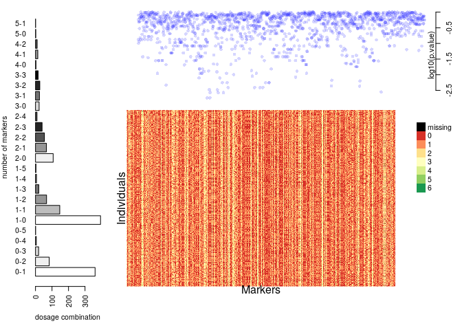<!-- -->

The bar plot in the left-hand side, is a graphical representation of the number of markers per each dosage combination in both parents. The numbers separated by a dash indicate the dose in parents $P_1$ and $P_2$ respectively.  The $\log_{10}(p.value)$ from a chi-square test for the expected segregation patterns under Mendelian inheritance for all markers are shown in the upper-right panel. The lower-right panel shows a graphical representation of the dosage distribution in the full-sib population.

## Filtering

Now, let us select markers with associated p-value smaller then $0.05/1500 = 3.33 \times 10^{-5}$ (approximated Bonferroni correction)


```r
seq.filt<-filter_segregation(hexafake, chisq.pval.thres = 0.05/hexafake$n.mrk, inter = FALSE)
seq.filt<-make_seq_mappoly(seq.filt)
print(seq.filt)
```

```
## This is an object of class 'mappoly.sequence'
##     ------------------------
##     Parameters not estimated
##     ------------------------
##     Ploidy level:       6 
##     No. individuals:    300 
##     No. markers:        1500 
## 
##     ----------
##     No. markers per sequence:
##  sequence No.mrk
##         1    600
##         2    400
##         3    500
## 
##     ----------
##     No. of markers per dosage in both parents:
##     dP dQ freq
##      0  1  361
##      0  2   83
##      0  3   19
##      0  4    5
##      0  5    1
##      1  0  394
##      1  1  147
##      1  2   67
##      1  3   20
##      1  4    6
##      1  5    3
##      2  0  107
##      2  1   66
##      2  2   54
##      2  3   40
##      2  4    9
##      3  0   22
##      3  1   24
##      3  2   26
##      3  3   16
##      4  0    3
##      4  1   14
##      4  2   10
##      5  0    2
##      5  1    1
```

In this case, the filtering did not affect since none of the markers were below the threshold. 

## Inspecting a specific marker

Now, let us assess the information of a specific marker, in this case marker `"M_344"`, using the function `plot_mrk_info`


```r
plot_mrk_info(input.data = hexafake, mrk = "M_344")
```

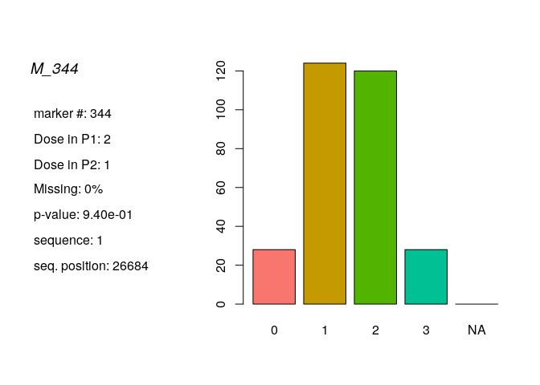<!-- -->
In this Figure, we have the position of the markers in the data set (344), de dosage in both parents (2 and 1) the amount of missing data (0%), The p-value for the segregation test, the chromosome and position the SNP is located in the reference genome and finally the threshold we used to assume missing data. The barplot on the right-hand side indicates the frequency of each dosage in the offspring. 

## Eliminating redundant markers

Frequently closely linked markers carry the same information about a specific genomic region and can be excluded from the analysis without modifying the results. To identify those markers, we use the function `elim_redundant`.


```r
## Filtering out redundant markers
seq.uni<-elim_redundant(input.seq = seq.filt)
plot(seq.uni)
```

<!-- -->

In this case, 190 markers (13%) were eliminated. Now we select the 87% non-redundant markers using the function `make_seq_mappoly`. 


```r
## Filtering out redundant markers
seq.all.lgs<-make_seq_mappoly(seq.uni)
```
OBS: To select all markers in the data set, we use the function `make_seq_mappoly` with `arg = 'all'`. It is also possible to load data only for a specific sequence using `arg = 'seqx'`, where `x` is the number of the sequence, provided in the input file. This feature can be useful in cases where the information about chromosomes or scaffold is available. It is also possible to load specific markers using a vector of numbers indicating the positions of the markers in the data set. 

# Two-point analysis

Once the markers where selected, we need to compute the pairwise recombination fraction between all these markers (two-point analysis). First, let us load the genotype counts ($\zeta_{\mbox{T}_{k},\mbox{T}_{k^{\prime}}}(l_{P}, l_{Q})$) defined in equation 20 in [Mollinari and Garcia, 2019](https://doi.org/10.1534/g3.119.400378). This object is fundamental to perform the dimension reduction of the transition space.


```r
counts<-cache_counts_twopt(input.seq = seq.all.lgs, get.from.web = TRUE)
```

```
## Internet conectivety ok.
## Loading genotype counts from web
```

```r
counts
```

```
##   This is an object of class 'cache.info'
##   -----------------------------------------------------
##   Ploidy level:                                6 
##   No. marker combinations:                     2401 
##   -----------------------------------------------------
```

The function `est_pairwise_rf` estimates all the pairwise recombination fractions in the sequence provided. Since the output object is too big to be fully displayed on the screen , MAPpoly shows a summary. Notice that parallel computation is available and in this case we used 16 CPU's to perform the computations.


```r
#3.6 minutes
all.rf.pairwise <- est_pairwise_rf(input.seq = seq.all.lgs, 
                                   count.cache = counts, 
                                   n.clusters = 16)
```

```
## INFO: Using  16  CPUs for calculation.
## INFO: Done with 857395  pairs of markers 
## INFO: Calculation took: 215.235 seconds
```

```r
all.rf.pairwise
```

```
##   This is an object of class 'poly.est.two.pts.pairwise'
##   -----------------------------------------------------
##   No. markers:                             1310 
##   No. estimated recombination fractions:   687581 (80.2%)
##   -----------------------------------------------------
```

To assess the recombination fraction between a particular pair of markers, say 802 and 959, we use

```r
all.rf.pairwise$pairwise$`802-959`
```

```
##        LOD_ph         rf      LOD_rf
## 2-2  0.000000 0.09356626 7.171220091
## 3-2 -1.227626 0.28061984 6.214118480
## 2-3 -1.227626 0.28061984 6.214118480
## 3-1 -1.790012 0.14123804 5.651732223
## 1-3 -1.790012 0.14123804 5.651732223
## 3-3 -2.781879 0.37084615 5.105580976
## 2-1 -7.169449 0.38978155 0.001771538
## 1-2 -7.169449 0.38978155 0.001771538
## 1-1 -7.172574 0.49995416 0.001353473
## 2-0 -7.442947 0.49995416 0.001202309
## 0-2 -7.442947 0.49995416 0.001202309
## 1-0 -7.444241 0.49995416 0.002497107
## 0-1 -7.444241 0.49995416 0.002497107
## 3-0 -7.737330 0.33572880 0.150129983
## 0-3 -7.737330 0.33572880 0.150129983
## 0-0 -7.893650 0.49991909 0.006189804
```

```r
plot(all.rf.pairwise, first.mrk = 802, second.mrk = 959)
```

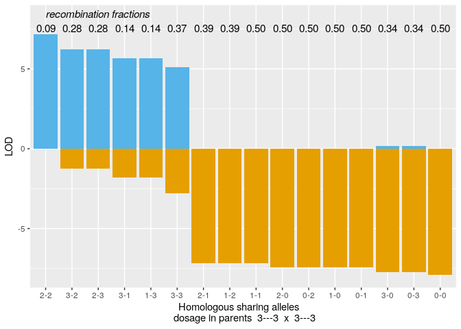<!-- -->

In this case, `802-959` represents the position of the markers in the original data set. The name of the rows in the output is of the form `x-y`, where `x` and `y` indicate how many homologs share the same allelic variant in parents $P_1$ and $P_2$, respectively (see [Mollinari and Garcia, 2019](https://doi.org/10.1534/g3.119.400378) and  [Mollinari et al., 2019](https://doi.org/10.1101/689638) for notation). The first column indicates the LOD Score in relation to the most likely linkage phase configuration. The second column shows the recombination fraction, and the third indicates the LOD Score comparing the likelihood under no linkage ($r = 0.5$) and the estimated recombination fraction (evidence of linkage).
In the next step, the two-point object should be converted into recombination fraction and LOD Score matrices. To select the recombination fractions for each marker pair, one needs to assume thresholds for the three columns observed in the previous output. The arguments `thresh.LOD.ph` and `thresh.LOD.rf` set LOD Scores thresholds for the second most likely linkage phase configuration and recombination fraction. Here we assume `thresh.LOD.ph = 0` and `thresh.LOD.rf = 0`, thus no matter how likely is the second best option, all the computed values will be considered. The argument `thresh.rf = 0.5` indicates that the maximum accepted recombination fraction is `0.5`. To convert these values in a recombination fraction matrix, we use the function `rf_list_to_matrix`


```
## INFO: Going singlemode. Using one CPU.
```

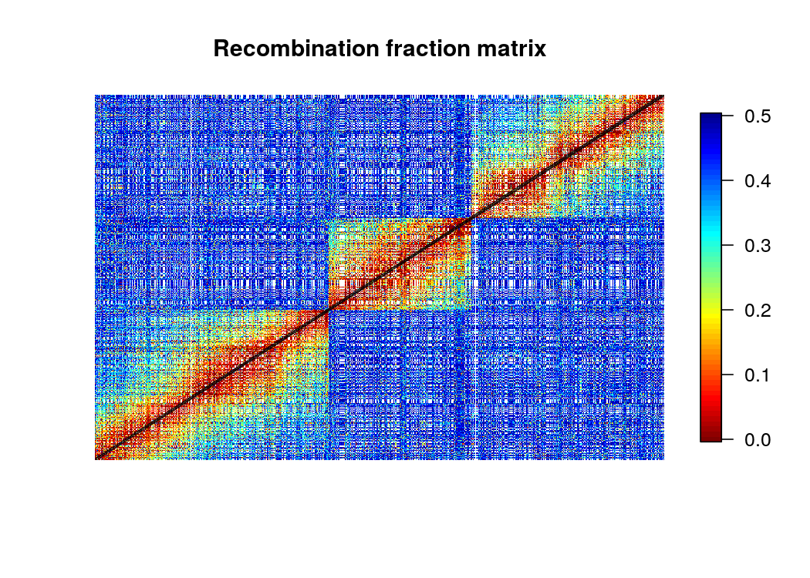<!-- -->

In the previous case, the thresholds allowed to plot almost all points in the recombination fraction matrix. The empty cells in the matrix indicate marker combinations where it is impossible to detect recombinant events using two-point estimates (e.g., between $1 \times 0$ and $0 \times 1$ marker). If these values become more stringent (LOD higher and lower rf), the matrix becomes more sparse. It is also important to notice that since the simulated data is ordered, it is possible to see a clear block diagonal pattern on the recombination fraction matrix. 

# Assembling linkage groups

The function `group_mappoly` assign markers to linkage groups using the recombination fraction matrix obtained above. The user can provide an expected number of groups or run the interactive version of the function using `inter = TRUE`. Since in this simulation we know the number of linkage groups, we use `expected.groups = 3`. If the data set provides the chromosome where the markers are located, the function allows to compare the groups obtained using the pairwise recombination fraction and the chromosome information provided using the `comp.mat = TRUE`. Please refer to [Mollinari et al., 2019](https://doi.org/10.1101/689638) for a real data set example.


```r
mat <- rf_list_to_matrix(input.twopt = all.rf.pairwise, 
                         thresh.LOD.ph = 2) # LOD = 2 to avoir false positives
```

```
## INFO: Going singlemode. Using one CPU.
```

```r
grs <- group_mappoly(input.mat = mat,
                     input.seq = seq.all.lgs,
                     expected.groups = 3,
                     comp.mat = TRUE, 
                     inter = FALSE)
grs
```

```
##   This is an object of class 'mappoly.group'
##   ------------------------------------------
##   Criteria used to assign markers to groups:
## 
##     - Number of markers:          1310 
##     - Number of linkage groups:   3 
##     - Number of markers per linkage groups: 
##     group n.mrk
##         1   538
##         2   329
##         3   443
##   ------------------------------------------
##     1   2   3 NoChr
## 1 538   0   0     0
## 2   0 329   0     0
## 3   0   0 443     0
##   ------------------------------------------
```

```r
plot(grs)
```

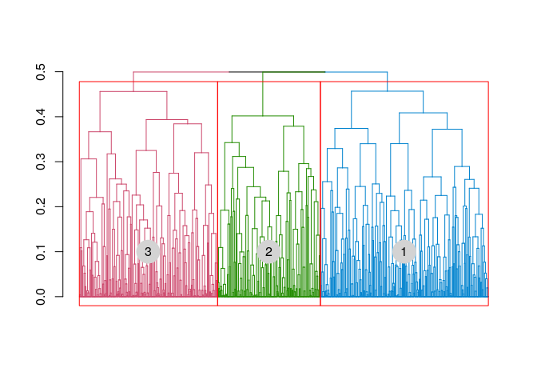<!-- -->

Once the linkage groups are properly assembled, we use the function `make_seq_mappoly` to make marker sequences from the group analysis. We will assemble a list with 3 positions, each one containing the corresponding linkage group sequence. Also, we will use only markers allocated in the diagonal of the previous comparison matrix. Thus only markers that were both assigned to a particular linkage group using both sources of information will be considered. We also will assemble smaller two-point objects to facilitate further parallelization procedures.


```r
LGS<-vector("list", 3)
for(j in 1:3){
  temp1<-make_seq_mappoly(grs, j)
  temp2<-get_genomic_order(temp1) # assembling sequence considering the genomic order
  lg.id<-as.numeric(names(which.max(table(temp2[,1]))))
  nm <- rownames(temp2)[which(temp2[,1] == lg.id)]
  temp3 <- make_seq_mappoly(hexafake, nm)
  tpt <- make_pairs_mappoly(all.rf.pairwise, input.seq = temp3)
  lgtemp<-rf_snp_filter(input.twopt = tpt)
  LGS[[lg.id]]<-list(lg = lgtemp, 
                 tpt = make_pairs_mappoly(all.rf.pairwise, input.seq = lgtemp))
}
```

Now, let us print the recombination fraction matrices or each linkage group.

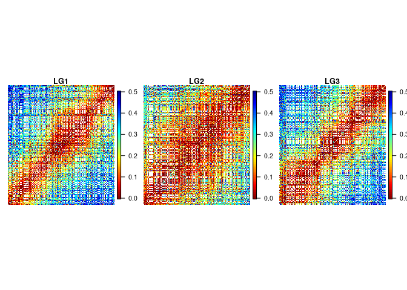<!-- -->

# Estimating the map for a given order

In this section, we will use the simulated marker order to estimate the map. The estimation of the genetic map for a given order involves the computation of recombination fraction between adjacent markers and also finding the linkage phase configuration of those markers in the parents. The core function to perform these tasks in MAPpoly is `est_rf_hmm_sequential`. This function uses the pairwise recombination fraction as the first source of information to sequentially position allelic variants in specific homologs. For situations where pairwise analysis has limited power, the algorithm relies on the likelihood obtained through a hidden Markov model (HMM) [Mollinari and Garcia, 2019](https://doi.org/10.1534/g3.119.400378).  Once all markers are positioned, the final map is reconstructed using the HMM multipoint algorithm. 


Several arguments are available to control the inclusion and phasing of the markers in the chain. `start.set` controls the number of markers that will be used to build a initial submap testing all possible linkage phases using HMM procedure. `thres.twopt` receives the threshold to whether when the linkage phases compared via two-point analysis should be considered, and the HMM analysis should not be used to infer the linkage phase (A. K. A. $\eta$ in [Mollinari and Garcia, 2019](https://doi.org/10.1534/g3.119.400378)). `thres.hmm` receives the threshold for keeping competing maps computed using HMM (if the two-point analysis was not enough) in the next round of marker insertion. `extend.tail` indicates the number of markers that should be considered at the end of the chain to insert a new marker. `tol` and `tol.final` receive the desired accuracy to estimate the sub-maps during the sequential phasing procedure and the desired accuracy in the final map. `phase.number.limit` receives the limit number of linkage phase configurations to be tested using HMM. `info.tail` is a logical argument and if `TRUE` it uses the complete informative tail (last markers in the chain that allow all homologous to be distinguished in the parents) of the chain to calculate the likelihood of the linkage phases. 

First, as an example, let us estimate the map for a small subset of markers in the map for linkage group 3. The values used in the function arguments, were obtained using a balance of processing speed and accuracy of the algorithm. As an exercise, it is interesting to try different values and check out the results. For now, let us stick with these values. First, let us select 20 at the beggining of linkage group 3


```r
# (~38 seconds)
stemp<-make_seq_mappoly(hexafake, arg = LGS[[3]]$lg$seq.mrk.names[1:20])
system.time(lg3.map<-est_rf_hmm_sequential(input.seq = stemp,
                                start.set = 6,
                                thres.twopt = 10, 
                                thres.hmm = 10,
                                extend.tail = 20,
                                info.tail = TRUE, 
                                twopt = LGS[[3]]$tpt,
                                sub.map.size.diff.limit = 2, 
                                phase.number.limit = 20,
                                reestimate.single.ph.configuration = TRUE,
                                tol = 10e-2,
                                tol.final = 10e-3))
```

```
## Number of markers: 20
```

```
## ═══════════════════════════════════════════════════════════════════════════════════════ Initial sequence ══
```

```
## 6 markers...
## ●    Trying sequence: 1 2 3 4 5 6 :
##        5 phase(s): . . . . .
```

```
## ═════════════════════════════════════════════════════════════════════════════ Done with initial sequence ══
```

```
## 7: 35% (1020): 2 ph(s) : (1/2)--t: 7
##     0.82: (0.18/0.01)✔
## 8: 40% (1025): 1 ph(s) : (1/1)--t: 8
##     1.5: (0.68/0.51)✔
## 9: 45% (1026): 4 ph(s) : (1/4)--t: 9
##     1.63: (0.12/-0.58)✔
## 10: 50% (1028): 1 ph(s) : (1/1)--t: 10
##     2.55: (0.92/0.28)✔
## 11: 55% (1030): 3 ph(s) : (1/3)--t: 11
##     3.73: (1.18/-0.07)✔
## 12: 60% (1031): 5 ph(s) : (1/5)--t: 12
##     4.81: (1.08/0.02)✔
## 13: 65% (1032): 5 ph(s) : (1/5)--t: 13
##     5.16: (0.35/-0.16)✔
## 14: not included (too many linkage phases)
## 15: 75% (1034): 5 ph(s) : (1/5)--t: 14
##     5.67: (0.51/-0.02)✔
## 16: 80% (1035): 6 ph(s) : (1/6)--t: 15
##     6.83: (1.16/0.08)✔
## 17: 85% (1036): 1 ph(s) : (1/1)--t: 16
##     7.15: (0.32/-0.09)✔
## 18: 90% (1038): 1 ph(s) : (1/1)--t: 17
##     7.33: (0.18/-0.03)✔
## 19: 95% (1039): 1 ph(s) : (1/1)--t: 18
##     8.15: (0.82/0.11)✔
## 20: 100% (1040): 1 ph(s) : (1/1)--t: 19
##     8.39: (0.23/0.01)✔
```

```
## ═════════════════════════════════════════════════════════════ Reestimating final recombination fractions ══
```

```
## Markers in the initial sequence: 20
## Maped markers                  : 19 (95%)
```

```
## ═══════════════════════════════════════════════════════════════════════════════════════════════════════════
```

```
##    user  system elapsed 
##  54.210   0.052  54.262
```

Now, we can display the results using the functions `print` and `plot`.


```r
print(lg3.map, detailed = TRUE)
```

```
## This is an object of class 'mappoly.map'
##     Ploidy level:	 6 
##     No. individuals:	 300 
##     No. markers:	 19 
##     No. linkage phases:	 1 
## 
##     ---------------------------------------------
##     Linkage phase configuration:  1
##        log-likelihood:	 -1095.885
##        LOD:		 0
## 
## 	        	 a b c d e f         g h i j k l   
##  	 M_1006 	 | | | | | |         o | | | | |      0.0 
##  	 M_1011 	 o | | | | |         | | | | | |      0.1 
##  	 M_1013 	 o o o | | |         | o | | | |      0.3 
##  	 M_1014 	 | | | | | |         | | o | | |      0.5 
##  	 M_1015 	 o o o | | |         | o | | | |      0.7 
##  	 M_1017 	 o | | | | |         | | | | | |      1.1 
##  	 M_1020 	 | o | | | |         | o | | | |      1.8 
##  	 M_1025 	 | o | | | |         | o | | | |      2.7 
##  	 M_1026 	 | | | o | |         | | | o o |      3.4 
##  	 M_1028 	 | o | | | |         | o o | | |      4.4 
##  	 M_1030 	 | | o | | |         | o | | | |      5.3 
##  	 M_1031 	 | | o | | |         o | | | | |      6.1 
##  	 M_1032 	 | | | | | |         | | | | | o      6.6 
##  	 M_1034 	 | | | | o |         | | | | | |      7.1 
##  	 M_1035 	 | | | | | o         | | | | | |      7.4 
##  	 M_1036 	 | | o | | o         | | | | | |      7.7 
##  	 M_1038 	 | | | | | |         | o | | | |      7.9 
##  	 M_1039 	 o | | | | |         | | o | | |      8.2 
##  	 M_1040 	 o | | | | |         | | o | | |      8.4 
## 
```

```r
plot(lg3.map)
```


Colored rectangles (red and blue) indicates the presence of the allelic variant in each one of the six homologous they are positioned in both parents, $P_1$ and $P_2$.

# Parallel map construction

In the fallowing example, we use the package `paralell` to perform the construction of the three linkage groups simultaneously.

## Using genomic order


```r
## Performing parallel computation
#(~4.2 hours)
my.phase.func<-function(X){
  x<-est_rf_hmm_sequential(input.seq = X$lg,
                                start.set = 5,
                                thres.twopt = 10, 
                                thres.hmm = 10,
                                extend.tail = 50,
                                info.tail = TRUE, 
                                twopt = X$tpt,
                                sub.map.size.diff.limit = 2, 
                                phase.number.limit = 10,
                                reestimate.single.ph.configuration = TRUE,
                                tol = 10e-2,
                                tol.final = 10e-4)
  return(x)
}
  cl <- parallel::makeCluster(3)
  parallel::clusterEvalQ(cl, require(mappoly))
  parallel::clusterExport(cl, "hexafake")
  MAPs <- parallel::parLapply(cl,LGS,my.phase.func)
  parallel::stopCluster(cl)
```


Plotting maps


```r
plot_map_list(MAPs)
```

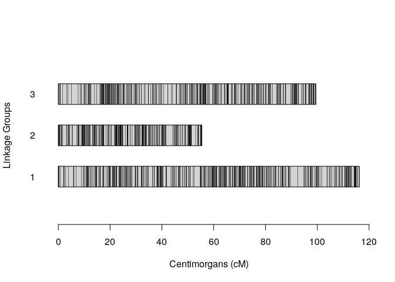<!-- -->


# Ordering markers

So far we reestimated the map using the simulated order. In real situations, unless a genomic information is provided, we need to order the markers using an optimization technique. Here, we use the MDS (multidimensional scaling) algorithm, proposed in the context of genetic mapping by [@Preedy2016]. It requires a recombination fraction matrix, which will be transformed in distance using a mapping function (in this case we use Haldane's mapping function). First, let us gather the pairwise recombination fractions for all three linkage groups


```r
mt <- lapply(LGS, function(x) rf_list_to_matrix(x$tpt))
```

Now, for each matrix contained in the object in `mt`, we use the MDS algorithm


```r
mds.ord <- lapply(mt, mds_mappoly)
```

```
## Registered S3 methods overwritten by 'MDSMap':
##   method       from   
##   plot.pcmap   mappoly
##   plot.pcmap3d mappoly
```

```
## Stress: 0.26421
## Mean Nearest Neighbour Fit: 0.43125Stress: 0.25549
## Mean Nearest Neighbour Fit: 0.43703Stress: 0.27266
## Mean Nearest Neighbour Fit: 0.49151
```

Now, let us compare the estimated and the simulated order using 

```r
op <- par(mfrow = c(1, 3), 
          pty = "s")       
sapply(mds.ord, function(x) {
  plot(x = x$locikey$confplotno, 
       y = x$locimap$confplotno, 
       xlab = "simulated order", 
       ylab = "estimated order")
  })
```

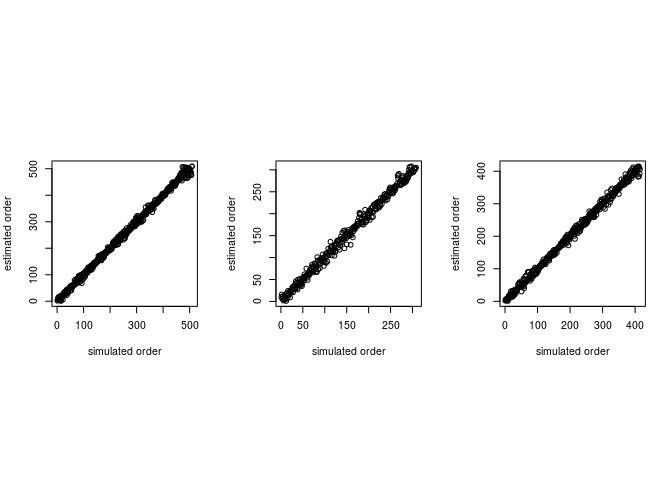<!-- -->

```
## [[1]]
## NULL
## 
## [[2]]
## NULL
## 
## [[3]]
## NULL
```

```r
par(op)
```

Although we can observe several local inconsistencies, the global diagonal patterns indicate a very good order for all linkage groups.

###Reestimating the genetic map

Now, given the estimated order, we reestimate the final map using the function `est_rf_hmm_sequential`


```r
## Performing parallel computation
## (~3.3 hours)
LGS.mds<-vector("list", 3)
for(j in 1:3){
  lgtemp<-make_seq_mappoly(mds.ord[[j]])
  LGS.mds[[j]]<-list(lg = lgtemp, 
                 tpt = make_pairs_mappoly(all.rf.pairwise, input.seq = lgtemp))
}
 cl <- parallel::makeCluster(3)
  parallel::clusterEvalQ(cl, require(mappoly))
```

```
## [[1]]
## [1] TRUE
## 
## [[2]]
## [1] TRUE
## 
## [[3]]
## [1] TRUE
```

```r
  parallel::clusterExport(cl, "hexafake")
  system.time(MAPs.denovo <- parallel::parLapply(cl,LGS.mds,my.phase.func))
```

```
##      user    system   elapsed 
##     0.347     0.020 10142.482
```

```r
  parallel::stopCluster(cl)
```


Plotting maps


```r
sapply(MAPs.denovo, plot)
```

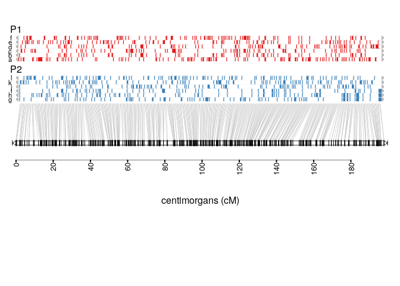<!-- -->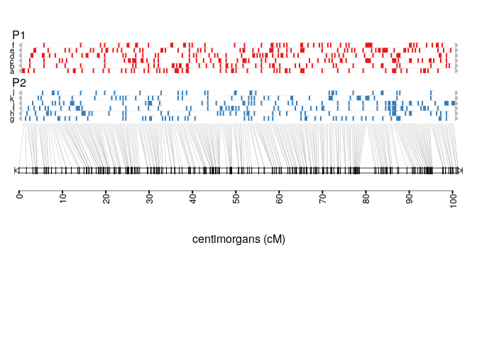<!-- -->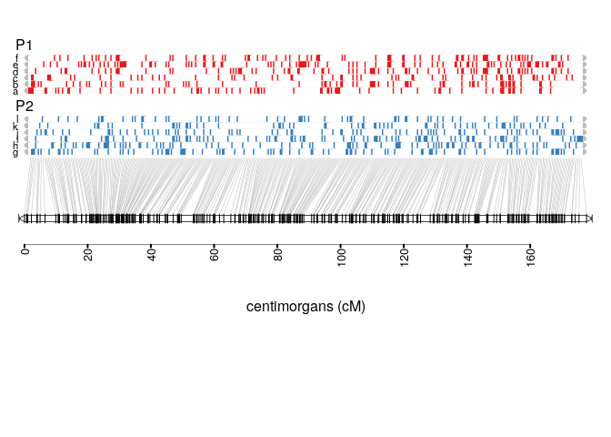<!-- -->

# Genotype conditional probabilities

In order to use the genetic map in QTL, we need to obtain the conditional probability of all possible 400 genotypes along the three linkage groups for all individuals in the full-sib population. This can be computed using the function `calc_genoprob`. 


```r
genoprob <- lapply(MAPs, calc_genoprob)
```

```
## 	Ploidy level: 6
## 	Number of markers: 500
## 	Number of individuals: 300
## 	..................................................
## 	..................................................
## 	..................................................
## 	..................................................
## 	..................................................
## 	..................................................
## 	
## 	Ploidy level: 6
## 	Number of markers: 307
## 	Number of individuals: 300
## 	..................................................
## 	..................................................
## 	..................................................
## 	..................................................
## 	..................................................
## 	..................................................
## 	
## 	Ploidy level: 6
## 	Number of markers: 410
## 	Number of individuals: 300
## 	..................................................
## 	..................................................
## 	..................................................
## 	..................................................
## 	..................................................
## 	..................................................
## 	
```

Each position of the object `genoprob` contains two elements: an array of dimensions $400 \times number \; of \; markers \times  number \; of \; individuals$ and the position of the markers in the maps in centimorgans. A graphical representation of the genotype probabilities along the three linkage groups in any individual (in this case individual 1) can be obtained using


```r
ind <- 3
dg <- sapply(genoprob, function (x) max(x$map))
dg <- dg/max(dg)
op <- par(mfrow = c(1, 3), 
          pty = "s")   
for(i in 1:3)
{
  d <- genoprob[[i]]$map
  image(t(genoprob[[i]]$probs[,,ind]),
        col=RColorBrewer::brewer.pal(n=9 , name = "YlOrRd"),
        axes=FALSE,
        xlab = "Markers",
        ylab = "",
        main = paste("LG", i))
  axis(side = 1, at = d/max(d),
       labels =rep("", length(d)), las=2)
}
```

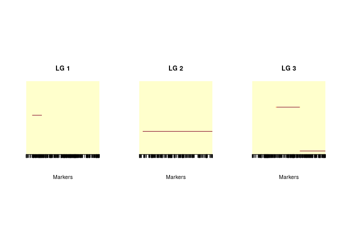<!-- -->

```r
par(op)
```

In this figure, the x-axis represents the genetic map and the y-axis represents the 400 possible genotypes in the full-sib population. The color scale varies from dark purple (high probabilityes) to light yellow (low probabilities). The `genoprob` object obtained here can be used to perform QTL analysis using the R package `QTLpoly` [@Pereira2019], which is an under development software to map multiple QTLs in full-sib families of outcrossing autopolyploid species. 


