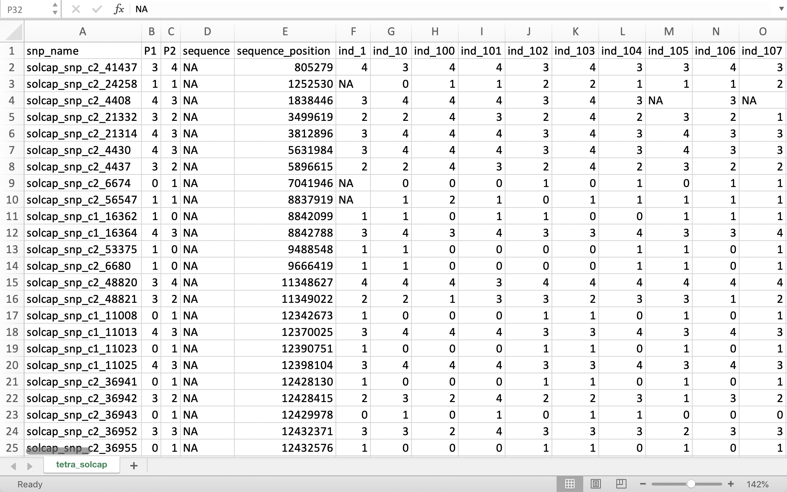
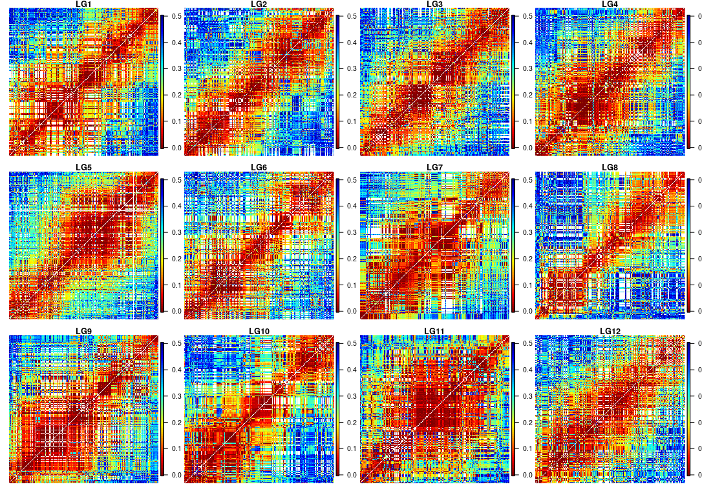

```{r setup, include=FALSE}
knitr::opts_chunk$set(echo = TRUE)
knitr::opts_chunk$set(cache = TRUE)
knitr::opts_chunk$set(eval = TRUE)
```

# Introduction

`mappoly` (v. 0.1.0) is an R package to construct genetic maps in autopolyploids with even ploidy levels. In its current version, `mappoly` can handle ploidy levels up to 8 when using hidden Markov models (HMM), and up to 12 when using the two-point simplification. All the two-point based functions are fast enough to run on standard computers. However, we strongly recommend using high-performance computation for HMM-based analysis, especially for ploidy levels higher than 4. 

Here we assume that the genotypic data is available and in the format required by `mappoly`. The primary purpose of this tutorial is to show some functions available in `mappoly` and how to use them sequentially to construct a genetic map. TThe derivation of the HMM used in `mappoly` can be found in [Mollinari and Garcia, 2019](https://doi.org/10.1534/g3.119.400378).

`mappoly` is not yet available in CRAN, but you can install it from Git Hub. Within R, you need to install the package `devtools`:

```R
install.packages("devtools")
```
To install `mappoly` from Git Hub use

```R
devtools::install_github("mmollina/mappoly")
```

# Loading `mappoly`

To load `mappoly`, simply type 

```{r load_mappoly, eval=TRUE, results='hide'}
library(mappoly)
```

## Loading datasets

In its current version, MAPpoly can handle three different types of datasets:

- CSV files
- MAPpoly files
  - Dosage based
  - Probability based
- VCF files (beta)

Please notice that both CSV and MAPpoly datasets are sensible to common errors, such as additional spaces, commas and wrong encoding (non-UTF-8). If you have trouble, please double check your files before submitting an issue. Detailed steps of all supported files are given on the sections below. Support for Illumina files is coming soon.

### Reading CSV files

The preparation of a CSV file for MAPpoly is quite straightforward. It can be done in Microsoft Excel or any other spreadsheet software of your preference.  In this file, each line comprehends a marker and each column comprehends information about the marker. In its current version, MAPpoly can handle .csv files with allelic dosage data. 

The first line of the CSV file should contain headers for all columns. The first five columns should contain the following information: marker name, the dosage of both parents, a sequence number (e.g., a chromosome number, if available) and a sequence position (e.g., the marker position within the chromosome, if available). In addition to these five headers, you should include the name of all individual in the population. From the second line onwards, all columns should contain its values, including allelic dosages for all individuals. Missing or absent values should be represented by NA.

NOTE: If genomic information is not available, the 'sequence' and 'sequence position' columns should be filled with NA's.

Example:

```{r, data set_example, out.width='90%', fig.align='center', fig.cap='Figure 1: Example of CSV data set', eval=TRUE, echo=FALSE}

```

**Important note: avoid spaces in .csv files.** As mentioned above, please double check your datasets for extra spaces, commas, dots and encoding. Your .csv file should be encoded using UTF-8.

You can read csv files with the `read_geno_csv` function:

```{r load_csv_file}
solcap.file <- system.file('extdata', 'tetra_solcap.csv', package = 'mappoly')
dat.dose.csv <- read_geno_csv(file.in  = solcap.file, ploidy = 4)
```
```{r check_load_csv_fil, include = FALSE}
if(any(check_data_sanity(dat.dose.csv)!=0))
  stop("Check chunck 'load_csv_file'")
```

In addition to the .csv file path, you should indicate the ploidy level using the `ploidy` argument. This function automatically excludes monomorphic markers, keeping only informative ones. It also performs chi-square tests for all markers, considering the expected segregation patterns under Mendelian inheritance, random chromosome pairing and no double reduction. You can optionally use the `filter.non.conforming` logical argument (default: TRUE), which excludes non-expected genotypes under these assumptions.

### Reading MAPpoly files

Besides CSV and VCF files, MAPpoly can also handle two more dataset types that follow the same format: a genotype-based file (wth allele dosages) (1) and a probability-based file (2). Both are pure text files with the same header, but different genotype table formats.

For both the header should contain ploidy level, number of individuals (nind), number of markers (nmrk), marker names (mrknames), individual names (indnames), allele dosages for parent 1 (dosageP), allele dosages for parent 2 (dosageQ), sequence/chromosome information (seq), position of each marker (seqpos), number of phenotipic traits (nphen) and the phenotypic data (pheno) if available. The header should be organized according to this example:

```
ploidy 4
nind 3
nmrk 5
mrknames M1 M2 M3 M4 M5
indnames Ind1 Ind2 Ind3
dosageP 0 2 0 0 3
dosageQ 1 2 1 1 3
seq 1 1 2 2 3
seqpos 100 200 50 150 80
nphen 0
pheno-----------------------
geno------------------------
```

For more information about MAPpoly file format, please see `?read_geno` and `?read_geno_dist` documentation from MAPpoly package.

#### Using `read_geno`

The header should be followed by a table containing the genotypes (allele dosages) for each marker (rows) and for each individual (columns), as follows:

|          | Individual 1 | Individual 2 | Individual 3 |
|----------|:------------:|:------------:|:------------:|
| Marker 1 | 1            | 0            | 0            |
| Marker 2 | 3            | 0            | 2            |
| Marker 3 | 1            | 0            | 0            |
| Marker 4 | 1            | 0            | 0            |
| Marker 5 | 3            | 4            | 4            |

The final file should look like the example below:

```
ploidy 4
nind 3
nmrk 5
mrknames M1 M2 M3 M4 M5
indnames Ind1 Ind2 Ind3
dosageP 0 2 0 0 3
dosageQ 1 2 1 1 3
seq 1 1 2 2 3
seqpos 100 200 50 150 80
nphen 0
pheno-----------------------
geno------------------------
1 0 0
3 0 2
1 0 0
1 0 0
3 4 4
```

Then, use the `read_geno` function to read your file:

```{r load_dose_file}
solcap.geno.file <- system.file('extdata', 'tetra_solcap_geno', package = 'mappoly')
dat.dose.mpl <- read_geno(file.in  = solcap.geno.file)
dat.dose.mpl
```
```{r check_load_dose_file, include = FALSE}
if(any(check_data_sanity(dat.dose.mpl)!=0))
  stop("Check chunck 'load_dose_file'")
if(!identical(dat.dose.csv, dat.dose.mpl))
  stop("Check chunck 'load_dose_file'")
```
This function automatically excludes monomorphic markers, keeping only informative ones. It also performs chi-square tests for all markers, considering the expected segregation patterns under Mendelian inheritance, random chromosome pairing and no double reduction. You can optionally use the `filter.non.conforming` logical argument (default: TRUE), which excludes non-expected genotypes under these assumptions. You can also define the p-value threshold used in the segregation test with the `thresh.line` parameter. 

#### Using `read_geno_dist`

Following the same header (described before) should be a table containing the probability distribution for each combination of marker $\times$ individual. Each line of this table represents the combination of one marker with one individual, and its respective probabilities of having each possible allele dosage. The first two columns represent the marker and the individual, respectively, and the remaining elements represent the probability associated with each one of the possible dosages, as follows:

| Marker | Individual | $p(d=0)$ | $p(d=1)$ | $p(d=2)$ | $p(d=3)$ | $p(d=4)$ |
|--------|:----------:|:--------:|:--------:|:--------:|:--------:|:--------:|
| M1     | Ind1       | 0.5      | 0.5      | 0.0      | 0.0      | 0.0      |
| M2     | Ind1       | 0.0      | 1.0      | 0.0      | 0.0      | 0.0      |
| M3     | Ind1       | 0.3      | 0.7      | 0.0      | 0.0      | 0.0      |
| M4     | Ind1       | 0.5      | 0.5      | 0.0      | 0.0      | 0.0      |
| M5     | Ind1       | 0.0      | 0.0      | 0.0      | 0.9      | 0.1      |
| M1     | Ind2       | 1.0      | 0.0      | 0.0      | 0.0      | 0.0      |
| M2     | Ind2       | 0.2      | 0.5      | 0.3      | 0.0      | 0.0      |
| M3     | Ind2       | 0.9      | 0.1      | 0.0      | 0.0      | 0.0      |
| M4     | Ind2       | 0.9      | 0.1      | 0.0      | 0.0      | 0.0      |
| M5     | Ind2       | 0.0      | 0.0      | 0.0      | 0.2      | 0.8      |
| M1     | Ind3       | 0.2      | 0.8      | 0.0      | 0.0      | 0.0      |
| M2     | Ind3       | 0.4      | 0.6      | 0.0      | 0.0      | 0.0      |
| M3     | Ind3       | 1.0      | 0.0      | 0.0      | 0.0      | 0.0      |
| M4     | Ind3       | 0.0      | 0.1      | 0.9      | 0.0      | 0.0      |
| M5     | Ind3       | 0.1      | 0.9      | 0.0      | 0.0      | 0.0      |

Please notice that each marker $\times$ individual combination have $m+1$ associated probabilities, being $m$ the ploidy level and $m+1$ the number of possible allele dosages. The final file (header + table) should look like this:

```
ploidy 4
nind 3
nmrk 5
mrknames M1 M2 M3 M4 M5
indnames Ind1 Ind2 Ind3
dosageP 0 2 0 0 3
dosageQ 1 2 1 1 3
seq 1 1 2 2 3
seqpos 100 200 50 150 80
nphen 0
pheno-----------------------
geno------------------------
M1 Ind1 0.5 0.5 0.0 0.0 0.0
M2 Ind1 0.0 1.0 0.0 0.0 0.0
M3 Ind1 0.3 0.7 0.0 0.0 0.0
M4 Ind1 0.5 0.5 0.0 0.0 0.0
M5 Ind1 0.0 0.0 0.0 0.9 0.1
M1 Ind2 1.0 0.0 0.0 0.0 0.0
M2 Ind2 0.2 0.5 0.3 0.0 0.0
M3 Ind2 0.9 0.1 0.0 0.0 0.0
M4 Ind2 0.9 0.1 0.0 0.0 0.0
M5 Ind2 0.0 0.0 0.0 0.2 0.8
M1 Ind3 0.2 0.8 0.0 0.0 0.0
M2 Ind3 0.4 0.6 0.0 0.0 0.0
M3 Ind3 1.0 0.0 0.0 0.0 0.0
M4 Ind3 0.0 0.1 0.9 0.0 0.0
M5 Ind3 0.1 0.9 0.0 0.0 0.0
```

Once the file is ready, use the function `read_geno_dist` to read it:

```{r load_data_w_probs}
solcap.file <- system.file('extdata', 'tetra_solcap_geno_dist.bz2', package = 'mappoly')
dat.dist.mpl <- read_geno_dist(file.in  = solcap.file, prob.thres = 0.95)
dat.dist.mpl
```
```{r check_load_data_w_probs, include = FALSE}
if(any(check_data_sanity(dat.dist.mpl)!=0))
  stop("Check chunck 'load_data_w_probs'")
```

**Important note:** as this type of file contains the probability distribution of the genotypes, it may take longer to read. 

This function automatically excludes monomorphic markers, keeping only informative ones. You can define the minimum probability necessary to call a dosage using the `prob.thres` argument. If the higher probability for a maker $\times$ individual passes this threshold, then its associated dosage is used. However, if none of the probabilities reach this threshold, then its dosage is considered missing (NA).
This function also performs chi-square tests for all markers, considering the expected segregation patterns under Mendelian inheritance, random chromosome pairing and no double reduction. You can optionally use the `filter.non.conforming` logical argument (default: TRUE), which excludes non-expected genotypes under these assumptions. <!-- You can also define the p-value threshold used in the segregation test with the `thresh.line` parameter. -->

### Reading VCF files

VCF files are less sensible to errors, because they are usually produced by automated SNP calling pipelines and less susceptible to user edition. MAPpoly can also handle VCF files (version 4.0 and higher) produced by the most common softwares such as TASSEL, GATK, Stacks and many others. However, few available softwares can handle poliploidy and estimate genotypes (allele dosages) correctly. Due to this, many other softwares are dedicated to correctly estimate the allele dosages considering ploidy. Briefly, these softwares model the ratio between allele read counts for each marker $\times$ individual combination, and determines which is the most probable allele dosage given the observed ratio and other *a priori* information. Examples of these softwares are [SuperMASSA](http://statgen.esalq.usp.br/SuperMASSA/), [fitTetra](https://cran.r-project.org/web/packages/fitTetra/index.html), [ClusterCall](https://potatobreeding.cals.wisc.edu/wp-content/uploads/sites/161/2017/08/ClusterCall_Download.zip), [updog](https://github.com/dcgerard/updog), [SNPready](https://github.com/cran/snpReady) and many others. After allele dosage estimation, your VCF file should contain values like **1/1/1/0** (for an autotetraploid) rather than **1/0**. Since MAPpoly still needs allele dosages (or their probabilities) to build genetic maps, we strongly recommend that you use one of these softwares to estimate allele dosages before building the map. We are working on an automated integration of these softwares with MAPpoly.

Once you have your VCF file, read it with `read_vcf` function:

```{r load_vcf_data}
tetra_vcf_file = system.file('extdata', 'tetra_example.vcf.gz', package = 'mappoly')
dat.dose.vcf = read_vcf(file.in = tetra_vcf_file, parent.1 = 'PARENT1', parent.2 = 'PARENT2')
dat.dose.vcf
```
```{r check_load_vcf_data, include = FALSE, eval = FALSE}
if(any(check_data_sanity(dat.dose.vcf)!=0))
  stop("Check chunck 'load_vcf_data'")
```

<!-- **Important note:** function `read_vcf` is under development, and still takes a long time to read -->
Besides the path to your VCF file, you should indicate `parent.1` and `parent.2` names. Please notice that their names should be exactly the same strings that appear in your VCF file. The ploidy level will be automatically detected, but you may indicate it using the `ploidy` argument (optional) to let the function check for possible errors. This function also performs chi-square tests for all markers, considering the expected segregation patterns under Mendelian inheritance, random chromosome pairing and no double reduction. You can optionally use the `filter.non.conforming` logical argument (default: TRUE), which excludes non-expected genotypes under these assumptions. The p-value threshold used the segregation test can be defined by the `thresh.line` argument. <!-- Arguments `update.prob` and `output` are coming soon. -->

The example .vcf dataset from _Urochloa decumbens_ [Ferreira2019](https://www.frontiersin.org/articles/10.3389/fpls.2019.00092/full) was obtained from raw sequencing data available at [NCBI](https://www.ncbi.nlm.nih.gov/sra/SRP148665), using both [TASSEL4Poly](https://github.com/guilherme-pereira/tassel4-poly) and [VCF2SM pipeline](https://github.com/guilherme-pereira/vcf2sm).

### Combining multiple datasets

Function `merge_data` is coming soon.

## Exploratory Analysis 

For didatic purposes, we will keep using the tetraploid potato array data (loaded using the examples above). We will construct a genetic map of the B2721 population, which is a cross between two tetraploid potato varieties: Atlantic and B1829-5. The population comprises 160 offsprings genotyped with the SolCAP Infinium 8303 potato array. The dataset also contains the genomic order of the SNPs from the _Solanum tuberosum_ genome version 4.03. The genotype calling was performed using fitTetra R package using [this pipeline](https://github.com/mmollina/Autopolyploid_Linkage/blob/master/src/solcap_map_construction/snp_calling/genotype_calling_public_data_fittetra.R). Another option would be to use ClusterCall and [this pipeline](https://mmollina.github.io/tutorials/solcap/solcap_example.html).

Once the data is loaded, you can explore the dataset using the `print` function:

```{r print_data_dose}
print(dat.dose.mpl, detailed = TRUE)
```

This function outputs information about the dataset including ploidy level, total number of individuals, total number of markers, number of informative markers and proportion of missing data. If `detailed = TRUE`, the function also outputs the number of markers in each sequence, if available, and the number of markers contained in all possible dosage combinations between both parents.

You can also explore the dataset visually using the `plot` function:

```{r plot_data_dose}
plot(dat.dose.mpl)
```

The output figure shows a bar plot on the left-hand side with the number of markers contained in each allele dosage combination between both parents. The right labels indicate allele dosages for Parent 1 and Parent 2, respectively. The upper-right plot contains the $\log_10(p-value)$ from $\chi^2$ tests for to all markers, considering the expected segregation patterns under Mendelian inheritance. The lower-right plot contains a graphical representation of the allele dosages and missing data distribution for all markers and individuals.

### Marker-specific

If you want to view a specific marker information, use the `plot_mrk_info` function. You should indicate your dataset object using the `input.data` argument, and the desired marker using the `mrk` argument. You can indicate the marker using its number or its name (string):

```{r mrk_info}
# For a dosage-based data analysis of marker 104
plot_mrk_info(input.data = dat.dose.mpl, mrk = 240)

# For a probability-based data analysis of the marker solcap_snp_c1_13686
plot_mrk_info(input.data = dat.dist.mpl, mrk = 'solcap_snp_c1_13686')
```

When applied to a dosage-based dataset, the function outputs a figure showing: marker name and position in the dataset, allele dosage in parents 1 and 2, proportion of missing data, p-value of the associated $\chi^2$ test for Mendelian segregation, sequence and position information (when available). The figure also contains a plot with the allele dosage and missing data distibution in the population.

When applied to a probability-baed dataset, the function also outputs the probability threshold and a
3-dimensional plot containing the probability distribution for each allele dosage, considering all individuals.


## Filtering and Quality Control

In order to build a good genetic map, good quality data is desired to guarantee reliable estimates of recombination fractions and linkage phases. High proportions of messy data will reduce this reliability, such as unexpected segregation patterns and missing data. Furthermore, available technologies are able to produce hundreds of thousands of markers, and mid to high proportion of redundant markers is expected. Markers that carry the same information are expected to be positioned in the same place, and the redundant ones may be removed from dataset before starting the process, in order to reduce computational effort. MAPpoly handle some filtering functions, described in the sections below.

### Missing data filtering

MAPpoly is able to filter markers and/or individuals that exceeds a defined threshold for missing data. The function `filter_missing` does this and creates or updates your dataset following the rules passed by its arguments. The argument `input.data` should contain your dataset object, and you can choose to filter by 'marker' or 'individual' using the `type` argument. You can also define the maximum proportion of missing data using the `filter.thres` argument (range: 0-1, i.e. a threshold of 0.2 will keep just markers or individuals with less than 20% of missing data). When TRUE (default), the `inter` argument plots markers or individuals vs. frequency of missing data.
 
```{r filter_missing}
# Filtering dataset by marker
dat.filt.mrk <- filter_missing(input.data = dat.dose.mpl, type = "marker", 
                               filter.thres = 0.2, inter = TRUE)
print(dat.filt.mrk)

# Filtering dataset by individual
dat.filt.ind <- filter_missing(input.data = dat.filt.mrk, type = "individual", 
                               filter.thres = 0.1, inter = TRUE)
print(dat.filt.ind)
dat.dose.filt <- dat.filt.ind
```

```{r check_filter_missing, include = FALSE}
if(any(check_data_sanity(dat.dose.filt)!=0))
  stop("Check chunck 'filter_missing'")
```

In this dataset, just 16 markers presented a proportion of missing data above the defined threshold, while no individual exceeded the defined threshold. Then we will keep the marker-based filtered dataset.

### Segregation test

Another very important point to consider is the expected marker segregation pattern under Mendelian inheritance. Markers with messy or distorted segregation would produce unreliable estimates, and may be removed (at least for a while) from the dataset. A good test for that is the chi-square ($\chi^2$) test, which basically matches expected genotype frequencies against observed frequencies and calculates the associated p-value. In order to define the p-value threshold for the tests, we will use the (conservative) Bonferroni correction: 

$$\alpha_{thres} = \frac{\alpha}{\#markers}$$

We will also assume that only random chromosome bivalent pairing occurs, and there is no double reduction.

```{r chisq_test}
pval.bonf <- 0.05/dat.dose.filt$n.mrk
mrks.chi.filt <- filter_segregation(dat.dose.filt, chisq.pval.thres =  pval.bonf, inter = TRUE)
seq.init<-make_seq_mappoly(mrks.chi.filt)
```

Please notice that `filter_segregation` does not produce a filtered dataset; it just tells you which markers follow the expected Mendelian segregation pattern. To select these markers from your dataset, you may use the `make_seq_mappoly` function.

```{r plot_filt_seq}
plot(seq.init)
```


### Redundant markers

As mentioned before, mid to high proportion of redundant markers is expected from modern genotyping platforms. As markers that have the same information does not provide any advantage during the mapping process, redundant ones may be removed from the dataset in order to reduce computational effort. The function `elim_redundant` identifies which markers have the same information, and outputs the informative markers that should be used during the mapping process.

```{r remove_redundant}
seq.redundant <- elim_redundant(input.seq = seq.init)
print(seq.redundant)
```

Here you can see which markers are redundant and non-informative to the mapping process. Once you have identified them, you can represent the proportion graphically with:

```{r plot_redundant}
plot(seq.redundant)
```

Please notice that `elim_redundant` does not produce a filtered sequence; it just tells you which markers are informative and which are redundant. To select just the informative ones, you may use the `make_seq_mappoly` function:

```{r make_unique_initial_sequence}
seq.unique <- make_seq_mappoly(seq.redundant)
```

# Two-point analysis

Once the markers where selected, we need to compute the pairwise recombination fraction between all of them (two-point analysis). First, let us load the genotype counts ($\zeta_{\mbox{T}_{k},\mbox{T}_{k^{\prime}}}(l_{P}, l_{Q})$) defined in equation 20 in [Mollinari and Garcia, 2019](https://doi.org/10.1534/g3.119.400378). This object is fundamental to perform the dimension reduction of the transition space.

```{r, load_counts, eval=TRUE}
counts<-cache_counts_twopt(input.seq = seq.unique, get.from.web = TRUE)
counts
```

The function `est_pairwise_rf` estimates all the pairwise recombination fractions in the sequence provided. Since the output object is too big to be fully displayed on the screen, `mappoly` shows a summary. Notice that parallel computation is available and in this case, we used 16 CPU's to perform the computations.
```{r, cache_twopt, eval=TRUE, echo=FALSE}
load(file = "~/repos/tutorials/potato/all_rf_pairwise_for_3654_mrks.RData")
```

```{r two_pt, eval=FALSE}
#(~ 9.5 minutes)
all.rf.pairwise <- est_pairwise_rf(input.seq = seq.unique, 
                                   count.cache = counts, 
                                   n.clusters = 16)
all.rf.pairwise
```

To assess the recombination fraction between a particular pair of markers, say 802 and 959, we use the following syntax:

```{r, plot_twopt_example, eval=TRUE, out.width = "500px", fig.align="center"}
all.rf.pairwise$pairwise$`93-98`
plot(all.rf.pairwise, first.mrk = 93, second.mrk = 98)
```

In this case, `93-98` represents the position of the markers in the filtered data set. The name of the rows have the form `x-y`, where `x` and `y` indicate how many homologous chromosomes share the same allelic variant in parents $P1$ and $P2$, respectively (see [Mollinari and Garcia, 2019](https://doi.org/10.1534/g3.119.400378) for notation). The first column indicates the LOD Score in relation to the most likely linkage phase configuration. The second column shows the recombination fraction, and the third indicates the LOD Score comparing the likelihood under no linkage ($r = 0.5$) and the estimated recombination fraction (evidence of linkage).

## Assembling the recombination fraction and LOD Score matrices

Recombination fraction and LOD Score matrices are fundamental in genetic mapping. Later in this tutorial, we will use these matrices as the basic information to order markers and also to perform some diagnostics. To convert the two-point object into recombination fraction and LOD Score matrices, we need to assume thresholds for the three columns observed in the previous output. The arguments `thresh.LOD.ph` and `thresh.LOD.rf` set LOD Scores thresholds for the second most likely linkage phase configuration and recombination fraction. Here we assume `thresh.LOD.ph = 0` and `thresh.LOD.rf = 0`, thus no matter how likely is the second best option, all the computed values will be considered. The argument `thresh.rf = 0.5` indicates that the maximum accepted recombination fraction is `0.5`. To convert these values in a recombination fraction matrix, we use the function `rf_list_to_matrix`

```{r rf_mat, echo=TRUE, eval = TRUE}
mat <- rf_list_to_matrix(input.twopt = all.rf.pairwise)
```

We can plot this matrix using the reference genome order. For doing so, we use the function `get_genomic_order` to get the genomic order of the input sequence and use the resulting order to index the recombination fraction matrix. If the reference order is consistent with the marker order in this specific population, we should observe a block-diagonal matrix and within each sub-matrix, a monotonic pattern. 

```{r plot_full_mat, eval=FALSE}
id<-get_genomic_order(seq.unique)
plot(mat, ord = rownames(id), index = FALSE)
```

```{r, data set_example2, out.width='90%', fig.align='center', fig.cap='Figure 1: Example of CSV data set', eval=TRUE, echo=FALSE}

```

As expected, we can observe the block-diagonal and monotonic patterns. In the previous case, the thresholds allowed to plot almost all points in the recombination fraction matrix. The empty cells in the matrix indicate markers where it is impossible to detect recombinant events using two-point estimates (e.g., between $1 \times 0$ and $0 \times 1$ marker). Yet, if the thresholds become more stringent (higher LODs and lower rf), the matrix becomes more sparse.  

# Assembling linkage groups

The function `group_mappoly` assign markers to linkage groups using the recombination fraction matrix obtained above. The user can provide an expected number of groups or run the interactive version of the function using `inter = TRUE`. Since in this data set we expect 12 linkage groups (basic chromosome number in potato), we use `expected.groups = 12`. If the data set provides the chromosome where the markers are located, the function allows comparing the groups obtained using the pairwise recombination fraction and the chromosome information provided using the `comp.mat = TRUE`.

```{r group, eval=TRUE}
grs <- group_mappoly(input.mat = mat,
                     input.seq = seq.unique,
                     expected.groups = 12,
                     comp.mat = TRUE, 
                     inter = TRUE)
grs
```

Here, we have the 3598 markers distributed in 12 linkage groups. The rows indicate linkage groups obtained using linkage information and the columns are the chromosomes in the reference genome. Notice the diagonal indicating the concordance between the two sources of information. Now, we can plot the resulting marker cluster analysis.

```{r plot_group, eval = TRUE}
plot(grs)
```

Once the linkage groups are properly assembled, we use the function `make_seq_mappoly` to make marker sequences from the group analysis. We will assemble a list with 12 positions, each one containing the corresponding linkage group sequence. Also, we will use only markers allocated in the diagonal of the previous comparison matrix. Thus only markers that were both assigned to a particular linkage group using both sources of information will be considered. We also will assemble smaller two-point objects to facilitate further parallelization procedures.

```{r make_lgs, eval=TRUE}
LGS<-vector("list", 12)
for(j in 1:12){
  temp1<-make_seq_mappoly(grs, j)
  temp2<-get_genomic_order(temp1) # assembling sequence considering the genomic order
  lg.id<-as.numeric(names(which.max(table(temp2[,1]))))
  nm <- rownames(temp2)[which(temp2[,1] == lg.id)]
  temp3 <- make_seq_mappoly(dat.dose.filt, nm)
  tpt <- make_pairs_mappoly(all.rf.pairwise, input.seq = temp3)
  lgtemp<-rf_snp_filter(input.twopt = tpt)
  LGS[[lg.id]]<-list(lg = lgtemp, 
                 tpt = make_pairs_mappoly(all.rf.pairwise, input.seq = lgtemp))
}
```

Now, let us print the recombination fraction matrices or each linkage group.

```{r, all_mat_rf, eval=TRUE, echo = FALSE, results='hide'}
op <- par(mfrow = c(3, 4), pty = "s", mar=c(1,1,1,1))
for(i in 1:12)
  plot(rf_list_to_matrix(LGS[[i]]$tpt), ord = LGS[[i]]$lg$seq.mrk.names, 
       main.text = paste0("LG", i), index = FALSE)
par(op)
```

# Estimating the map for a given order

In this section, we will use the marker order provided by the _Solanum tuberosum_ genome version 4.03. The _de novo_ marker ordering will be addressed later in this tutorial. The estimation of the genetic map for a given order involves the computation of recombination fraction between adjacent markers and also finding the linkage phase configuration of those markers in both parents. The core function to perform these tasks in `mappoly` is `est_rf_hmm_sequential`. This function uses the pairwise recombination fraction as the first source of information to sequentially position allelic variants in specific homologs. For situations where pairwise analysis has limited power, the algorithm relies on the likelihood obtained through a hidden Markov model (HMM) [Mollinari and Garcia, 2019](https://doi.org/10.1534/g3.119.400378).  Once all markers are positioned, the final map is reconstructed using the HMM multipoint algorithm. 


Several arguments are available to control the inclusion and phasing of the markers in the chain.  `thres.twopt` receives the threshold to whether when the linkage phases compared via two-point analysis should be considered, and the HMM analysis should not be used to infer the linkage phase (A. K. A. $\eta$ in [Mollinari and Garcia, 2019](https://doi.org/10.1534/g3.119.400378)). `thres.hmm` receives the threshold for keeping competing maps computed using HMM (if the two-point analysis was not enough) in the next round of marker insertion. `extend.tail` indicates the number of markers that should be considered at the end of the chain to insert a new marker. `tol` and `tol.final` receive the desired accuracy to estimate the sub-maps during the sequential phasing procedure and the desired accuracy in the final map. `phase.number.limit` receives the limit number of linkage phase configurations to be tested using HMM. `info.tail` is a logical argument and if `TRUE` it uses the complete informative tail (last markers in the chain that allow all homologous to be distinguished in the parents) of the chain to calculate the likelihood of the linkage phases. 

First, as an example, let us estimate the map for linkage group 3. The values used in the function arguments, were obtained using a balance of processing speed and accuracy of the algorithm. As an exercise, it is interesting to try different values and check out the results. For now, let us stick with the following values.

```{r, map_lg3, eval=TRUE}
lg3.map<-est_rf_hmm_sequential(input.seq = LGS[[3]]$lg,
                                start.set = 10,
                                thres.twopt = 10, 
                                thres.hmm = 10,
                                extend.tail = 200,
                                info.tail = TRUE, 
                                twopt = LGS[[3]]$tpt,
                                sub.map.size.diff.limit = 10, 
                                phase.number.limit = 20,
                                reestimate.single.ph.configuration = TRUE,
                                tol = 10e-3,
                                tol.final = 10e-4)
```

Now, we can display the results using the functions `print` and `plot`.

```{r, map_lg3_plot, echo=TRUE, eval=TRUE}
print(lg3.map)
plot(lg3.map)
```

Colored rectangles (red and blue) indicates the presence of the allelic variant in each one of the four homologous in both parents, $P_1$ and $P_2$.

## Reestimaing the map considering genotyping errors

Though current technologies enabled the genotyping of thousands of SNPs, they are quite prone to genotyping errors. One way to address this problem is to associate a probability distribution to each one of the markers and allow the HMM to update their probability. We can apply this procedure using either the probability distribution provided by the genotype calling software (loaded in MAPpoly using the function 'read_geno_dist') or assuming a global genotype error. For a detailed explanation of this procedure, please see [Mollinari and Garcia, 2019](https://doi.org/10.1534/g3.119.400378).  In this case, since we are analyzing the dosage data, with no probability distribution associated, we are going to use the second approch. Briefly, the use of the prior information will update the genotype of the markers based on a global chromosome structure. In this tutorial, since we are analyzing the dosage data, with no probability distribution associated, we are going to use the second approch. 

```{r, map_prior_lg3, eval=TRUE}
lg3.map.error<-est_full_hmm_with_global_error(input.map = lg3.map, error = 0.05)
plot(lg3.map.error)
```

Notice that we considered a global genotyping error of 5% and the resulting map is smaller than the previous. Also, some markers were "attracted" and some markers were "repealed". 

# Posterior genotype probabilities

Now, let us compute the posterior genotype probabilities which is a peace of information necessary to perform further QTL analysis. Let us use the function `calc_genoprob_error`, whcih, similarly to `est_full_hmm_with_global_error` allows the inclusion of a global genotyping error 

```{r, genoprob_3_soft, eval = TRUE}
genoprob.lg3<-calc_genoprob_error(input.map = lg3.map, error = 0.05)
```

Again, we used a lobal genotyping error of 5%. Each position of the object `genoprob.lg3` contains two elements: an array of dimensions $36 \times number \; of \; markers \times  number \; of \; individuals$ and the position of the markers in the maps in centimorgans.  Let us display the results for individual 1 in the full-sib popualtion

```{r plot_genoprob_prior, eval=TRUE}
ind <- 1
d <- genoprob.lg3$map
pr <- genoprob.lg3$probs[,,ind]
image(t(pr),
      col=RColorBrewer::brewer.pal(n=9 , name = "YlOrRd"),
      axes=FALSE,
      xlab = "Markers",
      ylab = "",
      main = paste("LG", i))
axis(side = 1, at = d/max(d),
     labels =rep("", length(d)), las=2)
axis(side = 2, at = seq(0,1,length.out = nrow(pr)),
     labels = rownames(pr), las=2, cex.axis=.5)
```

In this figure, the x-axis represents the genetic map and the y-axis represents the 36 possible genotypes in the full-sib population. The color scale varies from dark purple (high probabilityes) to light yellow (low probabilities). The `genoprob` object obtained here can be used to perform QTL analysis using the R package [QTLpoly](https://github.com/guilherme-pereira/QTLpoly), which is an under development software to map multiple QTLs in full-sib families of outcrossing autopolyploid species. 

# Ordering markers using MDS and reestimating the map

So far we reestimated the map using the genomic order. In real situations, unless a genomic information is provided, we need to order the markers using an optimization technique. Here, we use the MDS (multidimensional scaling) algorithm, proposed in the context of genetic mapping by [Preedy and Hackett (2016)](https://link.springer.com/article/10.1007%2Fs00122-016-2761-8). The MDS algorithm requires a recombination fraction matrix, which will be transformed in distance using a mapping function (in this case we use Haldane's mapping function). First, let us gather the pairwise recombination fractions for all three linkage groups

```{r mat_for_ordering, results='hide', eval=TRUE}
mt <- lapply(LGS, function(x) rf_list_to_matrix(x$tpt))
```

Now, for each matrix contained in the object in `mt`, we use the MDS algorithm

```{r mds, results='hide', eval=TRUE}
mds.ord <- lapply(mt, mds_mappoly)
```
Usually, at this point, the user plot diagnostic plots to remove markers that are disturbing the ordering procedure. Here we didn't use that procedure, but we encourage the user to check the example in `?mds_mappoly`. Now, let us compare the estimated and the simulated order 
```{r compare_order, eval=TRUE, results='hide'}
LGS.mds<-vector("list", 12)
for(j in 1:12){
  lgtemp<-make_seq_mappoly(mds.ord[[j]])
  LGS.mds[[j]]<-list(lg = lgtemp, 
                 tpt = make_pairs_mappoly(all.rf.pairwise, input.seq = lgtemp))
}
op <- par(mfrow = c(3, 4), pty = "s", mar=c(1,1,1,1)) 
sapply(LGS.mds, function(x) {
  plot(x = order(x$lg$sequence.pos), 
       y = rank(x$lg$seq.num), 
       xlab = "genomic order", 
       ylab = "estimated order")
  })
par(op)
```

Although we can observe several local inconsistencies, the global diagonal patterns indicate a very good order for all linkage groups. Now, let us build the genetic map of linkage group 3 using the MDS order

```{r, map_lg3_mds, eval=TRUE}
lg3.map.mds<-est_rf_hmm_sequential(input.seq = LGS.mds[[3]]$lg,
                                start.set = 10,
                                thres.twopt = 10, 
                                thres.hmm = 10,
                                extend.tail = 200,
                                info.tail = TRUE, 
                                twopt = LGS.mds[[3]]$tpt,
                                sub.map.size.diff.limit = 10, 
                                phase.number.limit = 20,
                                reestimate.single.ph.configuration = TRUE,
                                tol = 10e-3,
                                tol.final = 10e-4)
```

```{r lg3_map_mds_plot, results='hide', eval=TRUE}
plot(lg3.map.mds)
plot_map_list(list(lg3.map, lg3.map.mds), col = c("red", "blue"), title = "")
```

Comparing the genomic-based and the MDS-based maps, the first one is smaller, with the same number of markers, indicating a better result. However, to formally compare both maps, we need to select the markers present in both maps should be the same. Interestingly enough, both procedures included the same markers in the final map. However, we provide the code to perform the comparison even if the maps share a subset of markers

```{r map_comp, eval=TRUE, results='hide'}
mrks.in.gen<-intersect(lg3.map$maps[[1]]$seq.num, lg3.map.mds$maps[[1]]$seq.num)
mrks.in.mds<-intersect(lg3.map.mds$maps[[1]]$seq.num, lg3.map$maps[[1]]$seq.num)
if(cor(mrks.in.gen, mrks.in.mds) < 0){
  mrks.in.mds <- rev(mrks.in.mds)
  lg3.map.mds <- rev_map(lg3.map.mds)
}
map.comp.3.gen<-get_submap(input.map = lg3.map, match(mrks.in.gen, lg3.map$maps[[1]]$seq.num), verbose = FALSE)
map.comp.3.mds<-get_submap(input.map = lg3.map.mds, match(mrks.in.mds, lg3.map.mds$maps[[1]]$seq.num), verbose = FALSE)
dist.3.gen<-extract_map(lg3.map)
dist.3.mds<-extract_map(lg3.map.mds)
names(dist.3.gen)<-map.comp.3.gen$maps[[1]]$seq.num
names(dist.3.mds)<-map.comp.3.mds$maps[[1]]$seq.num       
matplot(t(data.frame(dist.3.gen,dist.3.mds[names(dist.3.gen)])), 
        type="b", pch="_", col=1, lty=1, lwd = .5, xlab= "", 
        ylab="Marker position (cM)", axes = F)
axis(2)
mtext(text = round(map.comp.3.gen$maps[[1]]$loglike,1), side = 1, adj = 0)
mtext(text = round(map.comp.3.mds$maps[[1]]$loglike,1), side = 1, adj = 1)
mtext(text = "Genomic", side = 3, adj = 0)
mtext(text = "MDS", side = 3, adj = 1)
```

Notice that we can observe the same local inversions shown in the dot plots presented earlier. In this case, the log-likelihood of the genomic order is higher than the one obtained using the MDS order. Thus for this linkage group, we opted to use the genomic-based map.

# Parallel map construction

Now we will apply the mapping procedure to all linkage groups using parallelization. We will use the genomic order as an example. However, the user should compare the MDS and genomic maps in a similar way we did in the previous example. Also, some species may not have a useful reference genome. Thus, the MDS order is a valuable alternative.  

```{r hmm_map, results='hide', eval = TRUE}
## Performing parallel computation
my.phase.func<-function(X){
  x<-est_rf_hmm_sequential(input.seq = X$lg,
                                start.set = 10,
                                thres.twopt = 10, 
                                thres.hmm = 10,
                                extend.tail = 200,
                                info.tail = TRUE, 
                                twopt = X$tpt,
                                sub.map.size.diff.limit = 8, 
                                phase.number.limit = 10,
                                reestimate.single.ph.configuration = TRUE,
                                tol = 10e-3,
                                tol.final = 10e-4)
  return(x)
}
system.time({
  cl <- parallel::makeCluster(12)
  parallel::clusterEvalQ(cl, require(mappoly))
  parallel::clusterExport(cl, "dat.dose.filt")
  MAPs <- parallel::parLapply(cl,LGS,my.phase.func)
  parallel::stopCluster(cl)
})
```

We can plot a traditional linkage map including all linkage groups using the function `plot_map_list`

```{r print_maps, results='hide'} 
plot_map_list(MAPs, col = "ggstyle")
```

Similarly we did for linkage group 3, let us consider a global genotyping error of 5% to reestimate the final maps.

```{r reestimate_map_with_error}
my.error.func<-function(X){
  x<-est_full_hmm_with_global_error(input.map = X, 
                                    error = 0.05, 
                                    tol = 10e-4, 
                                    verbose = FALSE)
  return(x)
}
system.time({
  cl <- parallel::makeCluster(12)
  parallel::clusterEvalQ(cl, require(mappoly))
  parallel::clusterExport(cl, "dat.dose.filt")
  MAP.err <- parallel::parLapply(cl,MAPs,my.error.func)
  parallel::stopCluster(cl)
})
```

Let us compare both results

```{r final_plot}
all.MAPs <- NULL
for(i in 1:12) 
  all.MAPs<-c(all.MAPs, MAPs[i], MAP.err[i])
plot_map_list(map.list = all.MAPs, col = rep(c("#E69F00", "#56B4E9"), 12))
```

As our final map, we will chose the the one that includes the modeling of genotype errors.

```{r print_err_maps, results='hide'} 
plot_map_list(MAP.err)
```

# Genotype conditional probabilities

In order to use the genetic map in [QTLpoly](https://github.com/guilherme-pereira/QTLpoly), we need to obtain the conditional probability of all possible 36 genotypes along the 12 linkage groups for all individuals in the full-sib population. Again, let us use the function `calc_genoprob_error`. 

```{r genoprob_2, eval=TRUE, results='hide'}
genoprob.err <- vector("list", 12)
for(i in 1:12)
genoprob.err[[i]] <- calc_genoprob_error(input.map = MAP.err[[i]], error = 0.05)
```

Let us display the results for all linkage groups, individual 1

```{r plot_genoprob_all, eval = TRUE}
ind <- 1
dg <- sapply(genoprob.err, function (x) max(x$map))
dg <- dg/max(dg)
layout(matrix(1:12, ncol = 4), widths = dg)
for(i in 1:12)
{
  d <- genoprob.err[[i]]$map
  image(t(genoprob.err[[i]]$probs[,,ind]),
        col=RColorBrewer::brewer.pal(n=9 , name = "YlOrRd"),
        axes=FALSE,
        xlab = "Markers",
        ylab = "",
        main = paste("LG", i))
  axis(side = 1, at = d/max(d),
       labels =rep("", length(d)), las=2)
}
```

With the conditional probabilities computed, it is possible to use the object `genoprob.err` alongside with phenotypic data as the input of the software [QTLpoly](https://github.com/guilherme-pereira/QTLpoly).

```{r save, eval=FALSE, echo=FALSE, include=FALSE, eval=TRUE}
save.image(file = "maps.rda")
```

