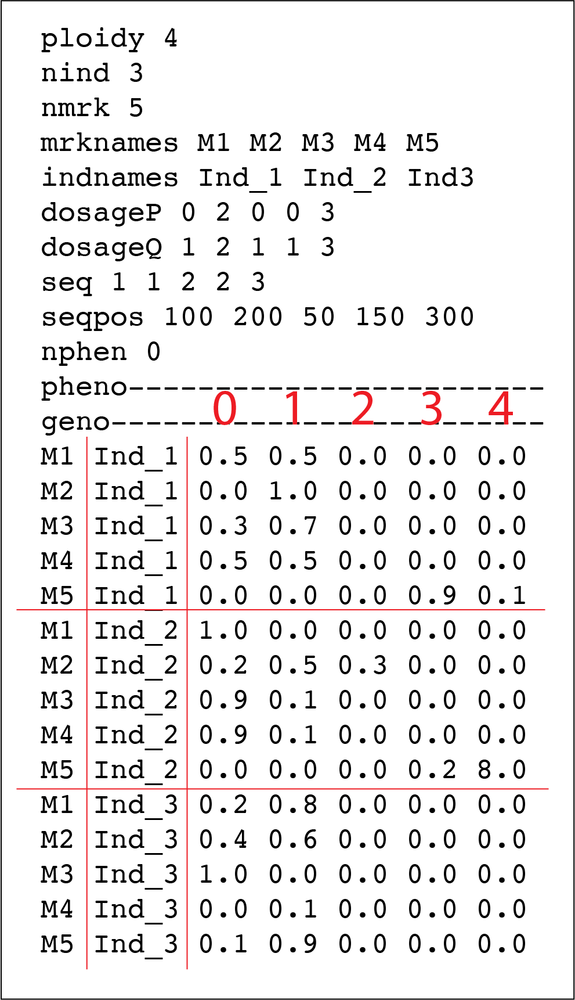

```{r setup, include=FALSE}
knitr::opts_chunk$set(echo = TRUE)
knitr::opts_chunk$set(cache = TRUE)
knitr::opts_chunk$set(eval = FALSE)
```

# Introduction

`mappoly` (v. 0.1.0) is an R package to construct genetic maps in autopolyploids with even ploidy levels. In its current version, `mappoly` can handle ploidy levels up to 8 when using hidden Markov models (HMM), and up to 12 when using the two-point simplification. All the two-point based functions are fast enough to run on standard computers. However, we strongly recommend using high-performance computation for HMM-based analysis, especially for ploidy levels higher than 4. 

Here we assume that the genotypic data is available and in the format required by `mappoly`. The primary purpose of this tutorial is to show some functions available in `mappoly` and how to use them sequentially to construct a genetic map. The derivation of the HMM used in `mappoly` is presented in [@Mollinari2018](https://doi.org/10.1101/415232 ).

`mappoly` is not yet available in CRAN, but you can install it from Git Hub. Within R, you need to install the package `devtools`:

```R
install.packages("devtools")
```
To install `mappoly` from Git Hub use

```R
devtools::install_github("mmollina/mappoly")
```

# Loading `mappoly`

To load `mappoly`, simply type 

```{r load_mappoly, eval=TRUE, results='hide'}
library(mappoly)
```

# Loading, inspecting and filtering data

In this tutorial, we will construct a genetic map of the B2721 population which is a cross between two tetraploid potato varieties: Atlantic $\times$ B1829-5. The population comprises 160 offsprings genotyped with the SolCAP Infinium 8303 potato array. The data set also contains the genomic order of the SNPs from the _Solanum tuberosum_ genome version 4.03. The genotype calling was performed using fitTetra R package using [this pipeline](https://github.com/mmollina/Autopolyploid_Linkage/blob/master/src/solcap_map_construction/snp_calling/genotype_calling_public_data_fittetra.R). Another option would be to use ClusterCall and [this pipeline](https://mmollina.github.io/tutorials/solcap/solcap_example.html). MAPpoly accepts two types of input files: the first one can be imported using the function `read_geno` contains and a header and a matrix of genotypes for each marker and offspring. A detailed description of the input file can be found in the function documentation (`?read_geno`). The second type of file contains the same header and a data frame with the (posterior) probability distribution for each combination of marker and offspring. It can be imported using the function `read_geno_dist`. Figure 1 shows an example of a data set containing genotype probabilities.

```{r, data set_example, out.width='40%', fig.align='center', fig.cap='Figure 1: Example of data set containing genotype probabilities', eval=TRUE, echo=FALSE}

```

## Loading the data set

Now, let us read the data set using the function `read_geno_dist`.

```{r load_data, eval=TRUE}
#(~46 seconds)
dat.pot<-read_geno_dist(file.in = "SolCAP", prob.thres = 0.9)
```

The loaded data set contains 4017 markers and 160 individuals. Notice that the program performed some filtering, eliminating non-informative markers (monomorphic) and also computed the p-value associated to the chi-square test for the expected segregation patterns under Mendelian inheritance for all markers. To inspect the data set, we just type

```{r print_datset, eval=TRUE}
print(dat.pot, detailed = TRUE)
```
The program prints a summary of the data set showing the ploidy level, the number of individuals, the number of markers and the percentage of missing data under a probability threshold (2.17%). In this case, data points with a maximum probability smaller than 0.9 were classified as "missing". It is important to mention that for hexaploids, you should use a lower threshold to include more multiple-dose markers in the analysis. In the next section, the number of markers per sequence (in our case, chromosomes) is shown followed by the number of markers per each dosage combination in both parents. Now, let us inspect the data set using some graphics

```{r plot_datset, eval=TRUE}
plot(dat.pot)
```

In the bar plot in the left-hand side, is a graphical representation of the number of markers per each dosage combination in both parents. The numbers separated by a dash indicate the dose in parents $P1$ and $P2$ respectively.  The $\log_{10}(p.value)$ from a chi-square test for the expected segregation patterns under Mendelian inheritance for all markers are shown in the upper-right panel. The lower-right panel shows a graphical representation of the dosage distribution in the full-sib population. 

## Filtering

After reading the data set, let us filter out markers with more than a certain percentage of missing data using the function `filter_missing`. In the following case, we are filtering out markers with more than 20% of missing data. You can make this number bigger, say `filter.thres = 0.3` or even `0.4`, but be aware that during the linkage analysis you will need to be extra cautious about false positives and marker ordering.

```{r, filtering_missing, eval=TRUE}
dat.pot.filt<-filter_missing(dat.pot, filter.thres = 0.2, inter = FALSE)
print(dat.pot.filt)
plot(dat.pot.filt) #based in a bonferroni aproximation
```

Notice that only 16 markers were eliminated, indicating excellent data quality. Now, let us select markers with associated p-value smaller then $0.05/4001 = 1.25 \times 10^{-5}$ (approximated Bonferroni correction)

```{r, select_mrk_chisq, eval = TRUE}
seq.filt<-filter_segregation(dat.pot.filt, chisq.pval.thres = 0.05/dat.pot.filt$n.mrk, inter = FALSE)
seq.filt<-make_seq_mappoly(seq.filt)
print(seq.filt)
```

In this case, the filtering did not affect since none of the markers were below the threshold. 

## Inspecting a specific marker

Now, let us assess the information of a specific marker, in this case marker `"solcap_snp_c1_13686"`, using the function `plot_mrk_info`

```{r, plot_mrk_info, eval = TRUE, out.width = "1000px"}
plot_mrk_info(input.data = dat.pot.filt, mrk = "solcap_snp_c1_13686")
```
In this Figure, we have the position of the markers in the data set (238), de dosage in both parents (2 and 3) the amount of missing data (1,2%), The p-value for the segregation test, the chromosome and position the SNP is located in the reference genome and finally the threshold we used to assume missing data. 

## Eliminating redundant markers

Frequently closely linked markers carry the same information about a specific genomic region and can be excluded from the analysis without modifying the results. To identify those markers, we use the function `elim_redundant`.

```{r, redundant_elimi, eval=TRUE}
## Filtering out redundant markers
seq.uni<-elim_redundant(input.seq = seq.filt)
plot(seq.uni)
```

In this case, 347 markers (9%) were eliminated. Now we select the 91% non-redundant markers using the function `make_seq_mappoly`. 

```{r, select_all, eval=TRUE}
## Filtering out redundant markers
seq.all.lgs<-make_seq_mappoly(seq.uni)
```
OBS: To select all markers in the data set, we use the function `make_seq_mappoly` with `arg = 'all'`. It is also possible to load data only for a specific sequence using `arg = 'seqx'`, where `x` is the number of the sequence, provided in the input file. This feature can be useful in cases where the information about chromosomes or scaffold is available. It is also possible to load specific markers using a vector of numbers indicating the positions of the markers in the data set. 

# Two-point analysis

Once the markers where selected, we need to compute the pairwise recombination fraction between all these markers (two-point analysis). First, let us load the genotype counts ($\zeta_{\mbox{T}_{k},\mbox{T}_{k^{\prime}}}(l_{P}, l_{Q})$) defined in equation 20 in [@Mollinari2018](https://doi.org/10.1101/415232 ). This object is fundamental to perform the dimension reduction of the transition space.

```{r, load_counts, eval=TRUE}
counts<-cache_counts_twopt(input.seq = seq.all.lgs, get.from.web = TRUE)
counts
```

The function `est_pairwise_rf` estimates all the pairwise recombination fractions in the sequence provided. Since the output object is too big to be fully displayed on the screen, `mappoly` shows a summary. Notice that parallel computation is available and in this case, we used 16 CPU's to perform the computations.
```{r, cache_twopt, eval=TRUE, echo=FALSE}
load("all_rf_pairwise_for_3654_mrks.RData")
```

```{r two_pt, eval=FALSE}
#(~ 9.5 minutes)
all.rf.pairwise <- est_pairwise_rf(input.seq = seq.all.lgs, 
                                   count.cache = counts, 
                                   n.clusters = 16)
all.rf.pairwise
```

To assess the recombination fraction between a particular pair of markers, say 802 and 959, we use the following syntax:

```{r, plot_twopt_example, eval=TRUE, out.width = "500px", fig.align="center"}
all.rf.pairwise$pairwise$`93-98`
plot(all.rf.pairwise, first.mrk = 93, second.mrk = 98)
```

In this case, `93-98` represents the position of the markers in the filtered data set. The name of the rows have the form `x-y`, where `x` and `y` indicate how many homologous chromosomes share the same allelic variant in parents $P1$ and $P2$, respectively (see [@Mollinari2018](https://doi.org/10.1101/415232 ) for notation). The first column indicates the LOD Score in relation to the most likely linkage phase configuration. The second column shows the recombination fraction, and the third indicates the LOD Score comparing the likelihood under no linkage ($r = 0.5$) and the estimated recombination fraction (evidence of linkage).

## Assembling the recombination fraction and LOD Score matrices

Recombination fraction and LOD Score matrices are fundamental in genetic mapping. Later in this tutorial, we will use these matrices as the basic information to order markers and also to perform some diagnostics. To convert the two-point object into recombination fraction and LOD Score matrices, we need to assume thresholds for the three columns observed in the previous output. The arguments `thresh.LOD.ph` and `thresh.LOD.rf` set LOD Scores thresholds for the second most likely linkage phase configuration and recombination fraction. Here we assume `thresh.LOD.ph = 0` and `thresh.LOD.rf = 0`, thus no matter how likely is the second best option, all the computed values will be considered. The argument `thresh.rf = 0.5` indicates that the maximum accepted recombination fraction is `0.5`. To convert these values in a recombination fraction matrix, we use the function `rf_list_to_matrix`

```{r rf_mat, echo=TRUE, eval = TRUE}
mat <- rf_list_to_matrix(input.twopt = all.rf.pairwise)
```

We can plot this matrix using the reference genome order. For doing so, we use the function `get_genomic_order` to get the genomic order of the input sequence and use the resulting order to index the recombination fraction matrix. If the reference order is consistent with the marker order in this specific population, we should observe a block-diagonal matrix and within each sub-matrix, a monotonic pattern. 

```{r plot_full_mat, dpi=200}
id<-get_genomic_order(seq.all.lgs)
plot(mat, ord = rownames(id), index = FALSE)
```

As expected, we can observe the block-diagonal and monotonic patterns. In the previous case, the thresholds allowed to plot almost all points in the recombination fraction matrix. The empty cells in the matrix indicate markers where it is impossible to detect recombinant events using two-point estimates (e.g., between $1 \times 0$ and $0 \times 1$ marker). Yet, if the thresholds become more stringent (higher LODs and lower rf), the matrix becomes more sparse.  

# Assembling linkage groups

The function `group_mappoly` assign markers to linkage groups using the recombination fraction matrix obtained above. The user can provide an expected number of groups or run the interactive version of the function using `inter = TRUE`. Since in this data set we expect 12 linkage groups (basic chromosome number in potato), we use `expected.groups = 12`. If the data set provides the chromosome where the markers are located, the function allows comparing the groups obtained using the pairwise recombination fraction and the chromosome information provided using the `comp.mat = TRUE`.

```{r group, eval=TRUE}
grs <- group_mappoly(input.mat = mat,
                     input.seq = seq.all.lgs,
                     expected.groups = 12,
                     comp.mat = TRUE, 
                     inter = TRUE)
grs
```

Here, we have the 3654 markers distributed in 12 linkage groups. The rows indicate linkage groups obtained using linkage information and the columns are the chromosomes in the reference genome. Notice the diagonal indicating the concordance between the two sources of information. Now, we can plot the resulting marker cluster analysis.

```{r plot_group, eval = TRUE}
plot(grs)
```

Once the linkage groups are properly assembled, we use the function `make_seq_mappoly` to make marker sequences from the group analysis. We will assemble a list with 12 positions, each one containing the corresponding linkage group sequence. Also, we will use only markers allocated in the diagonal of the previous comparison matrix. Thus only markers that were both assigned to a particular linkage group using both sources of information will be considered. We also will assemble smaller two-point objects to facilitate further parallelization procedures.

```{r make_lgs, eval=TRUE}
LGS<-vector("list", 12)
for(j in 1:12){
  temp1<-make_seq_mappoly(grs, j)
  temp2<-get_genomic_order(temp1) # assembling sequence considering the genomic order
  nm<-names(which(temp2[,1]==names(which.max(table(temp2[,1])))))
  lgtemp<-make_seq_mappoly(dat.pot.filt, nm)
  LGS[[j]]<-list(lg = lgtemp, 
                 tpt = make_pairs_mappoly(all.rf.pairwise, input.seq = lgtemp))
}
```

Now, let us print the recombination fraction matrices or each linkage group.

```{r, all_mat_rf, eval=TRUE, echo = FALSE, results='hide'}
op <- par(mfrow = c(3, 4), pty = "s", mar=c(1,1,1,1))
for(i in 1:12)
  plot(rf_list_to_matrix(LGS[[i]]$tpt), ord = LGS[[i]]$lg$seq.mrk.names, 
       main.text = paste0("LG", i), index = FALSE)
par(op)
```

# Estimating the map for a given order

In this section, we will use the marker order provided by the _Solanum tuberosum_ genome version 4.03. The estimation of the genetic map for a given order involves the computation of recombination fraction between adjacent markers and also finding the linkage phase configuration of those markers in the parents. The core function to perform these tasks in `mappoly` is `est_rf_hmm_sequential`. This function uses the pairwise recombination fraction as the first source of information to sequentially position allelic variants in specific homologs. For situations where pairwise analysis has limited power, the algorithm relies on the likelihood obtained through a hidden Markov model (HMM) [@Mollinari2018].  Once all markers are positioned, the final map is reconstructed using the HMM multipoint algorithm. 


Several arguments are available to control the inclusion and phasing of the markers in the chain.  `thres.twopt` receives the threshold to whether when the linkage phases compared via two-point analysis should be considered, and the HMM analysis should not be used to infer the linkage phase (A. K. A. $\eta$ in [@Mollinari2018](https://doi.org/10.1101/415232 )). `thres.hmm` receives the threshold for keeping competing maps computed using HMM (if the two-point analysis was not enough) in the next round of marker insertion. `extend.tail` indicates the number of markers that should be considered at the end of the chain to insert a new marker. `tol` and `tol.final` receive the desired accuracy to estimate the sub-maps during the sequential phasing procedure and the desired accuracy in the final map. `phase.number.limit` receives the limit number of linkage phase configurations to be tested using HMM. `info.tail` is a logical argument and if `TRUE` it uses the complete informative tail (last markers in the chain that allow all homologous to be distinguished in the parents) of the chain to calculate the likelihood of the linkage phases. 

First, as an example, let us estimate the map for linkage group 12. The values used in the function arguments, were obtained using a balance of processing speed and accuracy of the algorithm. As an exercise, it is interesting to try different values and check out the results. For now, let us stick with these values.

```{r, map_lg12, eval=TRUE, results='hide'}
# (~74 seconds)
lg12.map<-est_rf_hmm_sequential(input.seq = LGS[[12]]$lg,
                                start.set = 10,
                                thres.twopt = 10, 
                                thres.hmm = 10,
                                extend.tail = 20,
                                info.tail = TRUE, 
                                twopt = LGS[[12]]$tpt,
                                sub.map.size.diff.limit = 10, 
                                phase.number.limit = 20,
                                reestimate.single.ph.configuration = TRUE,
                                tol = 10e-3,
                                tol.final = 10e-4)
```

Now, we can display the results using the functions `print` and `plot`.

```{r, map_lg12_plot, echo=TRUE, eval=TRUE}
print(lg12.map)
plot(lg12.map)
```

Colored rectangles (red and blue) indicates the presence of the allelic variant in each one of the four homologous they are positioned in both parents, $P_1$ and $P_2$.

## Reestimaing the map considering the genotype probability distribution 

Since our data set contains the probability distribution for each combination of marker and offspring, we will use this information to reestimate the genetic map of linkage group 12. The use of this prior information will update the genotype of the markers based on a global chromosome structure.

```{r, map_err_lg12, eval=TRUE, results='hide'}
lg12.map.prior<-reest_map_geno_dist(lg12.map, dat.dist = dat.pot.filt, verbose = FALSE, tol = 10e-4)
plot(lg12.map.prior$reestimated.map)
```
Notice that the resulting map is smaller than the previous and some markers were "attracted" and some markers were "repealed". We will see the effect of these changes in a future section.

## Using a global error

This is similar to the strategy of using probability distribution of the markers. In this case, instead of using a specific probability distribution as the prior information, we will use a global error of 1%

```{r, map_prior_lg12, eval=TRUE}
lg12.map.error<-est_full_hmm_with_global_error(input.map = lg12.map, error = 0.01)
plot(lg12.map.error)
```

# Posterior genotype probabilities

Now, let us compute the posterior genotype probabilities. First, let us use the function  `calc_genoprob`. This function computes the genotype probabilities using the dosage information with no probability distribution associated. Actually, in this case, $\Pr(\text{assigned probabity}) = 1.0$ and zero for the remaining classes. Thus, the genotype probability on the called marker will not be updated, since we are using a full informative prior for each marker.

using functions `calc_genoprob` and `calc_genoprob_dist`. 

```{r, genoprob_12_hard, eval = TRUE}
genoprob.lg12<-calc_genoprob(input.map = lg12.map)
```

Each position of the object `genoprob.12` contains two elements: an array of dimensions $36 \times number \; of \; markers \times  number \; of \; individuals$ and the position of the markers in the maps in centimorgans.  Let us display the results for offspring 1

```{r plot_genoprob, eval=TRUE,  out.width='200%',,fig.align="center"}
ind <- 1
d <- genoprob.lg12$map
pr<-genoprob.lg12$probs[,,ind]
image(t(pr),
      col=RColorBrewer::brewer.pal(n=9 , name = "YlOrRd"),
      axes=FALSE,
      xlab = "Markers",
      ylab = "",
      main = paste("LG", i))
axis(side = 1, at = d/max(d),
     labels =rep("", length(d)), las=2)
axis(side = 2, at = seq(0,1,length.out = nrow(pr)),
     labels = rownames(pr), las=2, cex.axis=.5)
```

In this figure, the x-axis represents the genetic map and the y-axis represents the 36 possible genotypes in the full-sib population. The color scale varies from dark purple (high probabilityes) to light yellow (low probabilities). The `genoprob` object obtained here can be used to perform QTL analysis using the R package `QTLpoly` [@Pereira2019], which is an under development software to map multiple QTLs in full-sib families of outcrossing autopolyploid species. 

Now, let us use the function `calc_genoprob_dist`, whcih allows the inclusion of genotype probability distribution 

```{r, genoprob_12_soft, eval = TRUE}
genoprob.lg12.prior<-calc_genoprob_dist(input.map = lg12.map, dat.dist = dat.pot.filt)
```

Again, let us display the results for offspring 1

```{r plot_genoprob_prior, eval=TRUE}
ind <- 1
d <- genoprob.lg12.prior$map
pr<-genoprob.lg12.prior$probs[,,ind]
image(t(pr),
      col=RColorBrewer::brewer.pal(n=9 , name = "YlOrRd"),
      axes=FALSE,
      xlab = "Markers",
      ylab = "",
      main = paste("LG", i))
axis(side = 1, at = d/max(d),
     labels =rep("", length(d)), las=2)
axis(side = 2, at = seq(0,1,length.out = nrow(pr)),
     labels = rownames(pr), las=2, cex.axis=.5)
```


Notice that ...


# Ordering markers and reestimating the map

So far we reestimated the map using the genomic order. In real situations, unless a genomic information is provided, we need to order the markers using an optimization technique. Here, we use the MDS (multidimensional scaling) algorithm, proposed in the context of genetic mapping by [@Preedy2016]. It requires a recombination fraction matrix, which will be transformed in distance using a mapping function (in this case we use Haldane's mapping function). First, let us gather the pairwise recombination fractions for all three linkage groups

```{r mat_for_ordering, results='hide', eval=TRUE}
mt <- lapply(LGS, function(x) rf_list_to_matrix(x$tpt))
```

Now, for each matrix contained in the object in `mt`, we use the MDS algorithm

```{r mds, results='hide', eval=TRUE}
mds.ord <- lapply(mt, mds_mappoly)
```

Now, let us compare the estimated and the simulated order using 
```{r compare_order, eval=TRUE, results='hide'}
LGS.mds<-vector("list", 12)
for(j in 1:12){
  lgtemp<-make_seq_mappoly(mds.ord[[j]])
  LGS.mds[[j]]<-list(lg = lgtemp, 
                 tpt = make_pairs_mappoly(all.rf.pairwise, input.seq = lgtemp))
}
op <- par(mfrow = c(3, 4), pty = "s", mar=c(1,1,1,1)) 
sapply(LGS.mds, function(x) {
  plot(x = order(x$lg$sequence.pos), 
       y = rank(x$lg$seq.num), 
       xlab = "genomic order", 
       ylab = "estimated order")
  })
par(op)
```

Although we can observe several local inconsistencies, the global diagonal patterns indicate a very good order for all linkage groups.

Now, let us build the genetic map of linkage group 12 using the MDS order

```{r, map_lg12_mds, eval=TRUE, results='hide'}
# (~74 seconds)
lg12.map.mds<-est_rf_hmm_sequential(input.seq = LGS.mds[[12]]$lg,
                                start.set = 10,
                                thres.twopt = 10, 
                                thres.hmm = 10,
                                extend.tail = 20,
                                info.tail = TRUE, 
                                twopt = LGS.mds[[12]]$tpt,
                                sub.map.size.diff.limit = 10, 
                                phase.number.limit = 20,
                                reestimate.single.ph.configuration = TRUE,
                                tol = 10e-3,
                                tol.final = 10e-4)
```

```{r lg12_map_mds_plot, results='hide', eval=TRUE}
plot(lg12.map.mds)
print(lg12.map)
print(lg12.map.mds)
```

```{r map_comp, eval=TRUE, results='hide'}
#(intersection of 190 markers, out of 197 from genomeic order and 192 f )
mrks.in.gen<-intersect(lg12.map$maps[[1]]$seq.num, lg12.map.mds$maps[[1]]$seq.num)
mrks.in.mds<-intersect(lg12.map.mds$maps[[1]]$seq.num, lg12.map$maps[[1]]$seq.num)
map.comp.12.gen<-get_submap(input.map = lg12.map, match(mrks.in.gen, lg12.map$maps[[1]]$seq.num))
map.comp.12.mds<-get_submap(input.map = lg12.map.mds, match(mrks.in.mds, lg12.map.mds$maps[[1]]$seq.num))
dist.12.gen<-cumsum(c(0, imf_h(map.comp.12.gen$maps[[1]]$seq.rf)))
dist.12.mds<-cumsum(c(0, imf_h(map.comp.12.mds$maps[[1]]$seq.rf)))
names(dist.12.gen)<-map.comp.12.gen$maps[[1]]$seq.num
names(dist.12.mds)<-map.comp.12.mds$maps[[1]]$seq.num       
matplot(t(data.frame(dist.12.gen,dist.12.mds[names(dist.12.gen)])), 
        type="b", pch="_", col=1, lty=1, lwd = .5, xlab= "", 
        ylab="Marker position (cM)", axes = F)
axis(2)
mtext(text = round(map.comp.12.gen$maps[[1]]$loglike,1), side = 1, adj = 0)
mtext(text = round(map.comp.12.mds$maps[[1]]$loglike,1), side = 1, adj = 1)
mtext(text = "Genomic", side = 3, adj = 0)
mtext(text = "MDS", side = 3, adj = 1)
```


# Parallel map construction

In the fallowing example, we use the package `paralell` to perform the construction of the three linkage groups simultaneously.

## Using genomic order

```{r hmm_map, results='hide', eval = TRUE}
## Performing parallel computation
my.phase.func<-function(X){
  x<-est_rf_hmm_sequential(input.seq = X$lg,
                                start.set = 10,
                                thres.twopt = 10, 
                                thres.hmm = 10,
                                extend.tail = 50,
                                info.tail = TRUE, 
                                twopt = X$tpt,
                                sub.map.size.diff.limit = 8, 
                                phase.number.limit = 10,
                                reestimate.single.ph.configuration = TRUE,
                                tol = 10e-3,
                                tol.final = 10e-4)
  return(x)
}
system.time({
  cl <- parallel::makeCluster(12)
  parallel::clusterEvalQ(cl, require(mappoly))
  parallel::clusterExport(cl, "dat.pot.filt")
  MAPs <- parallel::parLapply(cl,LGS,my.phase.func)
  parallel::stopCluster(cl)
})
```

Now let us incude prior information

```{r all_maps_error, results='hide', eval = TRUE}
MAPs.err <- MAPs.prior <- vector("list", 12)
for(i in 1:12){
  cat("LG:", i ,"\n")
   MAPs.err[[i]] <- est_full_hmm_with_global_error(input.map = MAPs[[i]], error = 0.05, tol = 10e-4, verbose = FALSE)
   MAPs.prior[[i]] <- reest_map_geno_dist(input.map = MAPs[[i]], dat.dist = dat.pot.filt, verbose = FALSE, tol = 10e-4)
}
```

Plotting maps

```{r print_maps, results='hide'} 
sapply(MAPs, function(x) plot(x$reestimated.map))
sapply(MAPs.err, function(x) plot(x$reestimated.map))
sapply(MAPs.prior, function(x) plot(x$reestimated.map))
```

# Genotype conditional probabilities

In order to use the genetic map in QTL, we need to obtain the conditional probability of all possible 32 genotypes along the 12 linkage groups for all individuals in the full-sib population. Again, let us use the function `calc_genoprob`. 


```{r genoprob_2, eval=TRUE, results='hide'}
genoprob.prior <- vector("list", 12)
for(i in 1:12)
genoprob.prior[[i]] <- calc_genoprob_dist(input.map = MAPs.prior[[i]], dat.dist =dat.pot.filt)
```


```{r plot_genoprob_all, eval = TRUE}
ind <- 2
dg <- sapply(genoprob.prior, function (x) max(x$map))
dg <- dg/max(dg)
layout(matrix(1:12, ncol = 4), widths = dg)
for(i in 1:12)
{
  d <- genoprob.prior[[i]]$map
  image(t(genoprob.prior[[i]]$probs[,,ind]),
        col=RColorBrewer::brewer.pal(n=9 , name = "YlOrRd"),
        axes=FALSE,
        xlab = "Markers",
        ylab = "",
        main = paste("LG", i))
  axis(side = 1, at = d/max(d),
       labels =rep("", length(d)), las=2)
}
```


```{r save, eval=FALSE, echo=FALSE, include=FALSE, eval=TRUE}
save.image(file = "maps.rda", compress = TRUE)
```

# References
